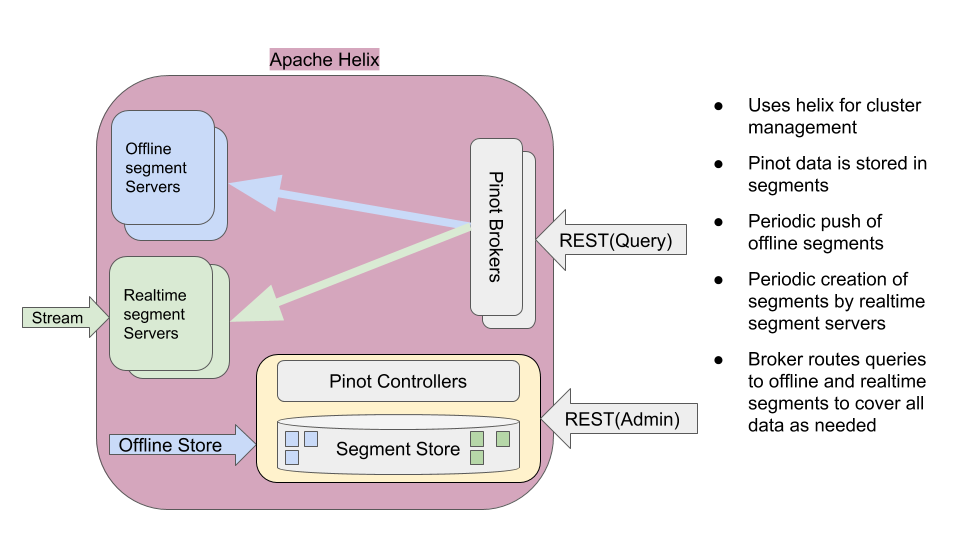

Architecture
============

   Pinot Architecture Overview

Terminology
-----------

* Table: A table is a logical abstraction to refer to a collection of related data. It consists of columns and rows (Document). Table Schema defines column names and their metadata.
* Segment: Data in table is divided into shards referred to as segments.

Pinot Components
----------------

* Pinot Controller: Manages other pinot components (brokers, servers) as well as controls assignment of tables/segments to servers.
* Pinot Server: Hosts one or more segments and serves queries from those segments
* Pinot Broker: Accepts queries from clients and routes them to one or more servers, and returns consolidated response to the server.

Pinot leverages `Apache Helix <http://helix.apache.org>`_ for cluster management. 
Apache Helix is a generic cluster management framework to manage partitions and replicas in a distributed system. See http://helix.apache.org for additional information.
Helix uses Zookeeper to store cluster state and metadata.

Briefly, Helix divides nodes into 3 logical components based on their responsibilities:

*  **Participant**: The nodes that host distributed, partitioned resources
*  **Spectator**: The nodes that observe the current state of each Participant and use that information to access the resources.
   Spectators are notified of state changes in the cluster (state of a participant, or that of a partition in a participant).
*  **Controller**: The node that observes and controls the Participant nodes. It is responsible for coordinating all transitions
   in the cluster and ensuring that state constraints are satisfied while maintaining cluster stability

Pinot Controller hosts Helix Controller, in addition to hosting APIs for Pinot cluster administration and data ingestion.
There can be multiple instances of Pinot controller for redundancy. If there are multiple controllers, Pinot expects that all
of them are configured with the same back-end storage system so that they have a common view of the segments (_e.g._ NFS).
Pinot can use other storage systems such as HDFS or `ADLS <https://azure.microsoft.com/en-us/services/storage/data-lake-storage/>`_.

Pinot Servers are modeled as Helix Participants, hosting Pinot tables (referred to as 'resources' in helix terminology).
Segments of a table are modeled as Helix partitions (of a resource). Thus, a Pinot server hosts one or more helix partitions of one
or more helix resources (_i.e._ one or more segments of one or more tables).

Pinot Brokers are modeled as Spectators. They need to know the location of each segment of a table and route requests to the
appropriate server that hosts the segments of the table being queried. In general, all segments must be queried exactly once
in order for a query to return the correct response. There may be multilpe copies of a segment (for redundancy). Helix provides
the framework by which spectators can learn the location (i.e. participant) in which each partition of a resource resides.

Pinot tables
------------

Tables in Pinot can be configured to be offline only, or realtime only, or a hybrid of these two.

Segments for offline tables are constructed outside of Pinot, typically in Hadoop via map-reduce jobs. These segments are then ingested
into Pinot via REST API provided by the Controller. The controller looks up the table's configuration and assigns the segment
to the servers that host the table. It may assign multiple servers for each servers depending on the number of replicas 
configured for that table.
Pinot provides libraries to create Pinot segments out of input files in AVRO, JSON or CSV formats in a hadoop job, and push
the constructed segments to the controlers via REST APIs.

Pinot supports different segment assignment strategies that are optimized for various use cases.

Once segments are assigned, Pinot servers get notified via Helix to "host" the segment. The servers download the segments
(as a cached local copy to serve queries) and load them into local memory. All segment data is maintained in memory as long
as the server hosts that segment.

Once the server has loaded the segment, brokers come to know of the availability of these segments and start include the new
segments for queries. Brokers support different routing strategeies depending on the type of table, the segment assignment
strategy and the use case.

Realtime tables, on the other hand, ingest data directly from incoming data streams (such as Kafka). Multiple servers may
ingest the same data for replication. The servers stop ingesting data after reaching a threshold and "build" a segment of
the data ingested so far. Once that segment is loaded (just like the offline segments described earlier), they continue
to consume the next set of events from the stream.

Depending on the type of consumer configured, realtime segments may be held locally in the server, or pushed the controller.

**TODO Add reference to the realtime section here**

A hybrid Pinot table essentially has both realtime as well as offline tables. 
In such a table, offline segments may be pushed periodically (say, once a day). The retention on the offline table
can be set to a high value (say, a few years) since segments are coming in on a periodic basis, whereas the retention
on the realtime part can be small (say, a few days). Once an offline segment is pushed to cover a recent time period,
the brokers automatically switch to using the offline table for segments in _that_ time period, and use realtime table
only to cover later segments for which offline data may not be available yet.

Note that the query does not know the existence of offline or realtime tables. It only specifies the table name
in the query.

Pinot Segments
--------------
As mentioned earlier, each Pinot segment is a horizontal shard of the Pinot table. The segment is laid out in a columnar format
so that it can be directly mapped into memory for serving queries. Columns may be single or multi-valued. Column types may be
STRING, INT, LONG, FLOAT, DOUBLE or BYTES. Columns may be declared to be metric or dimension (or specifically as a time dimension)
in the schema.

Pinot uses dictionary encoding to store values as a dictionary ID. Columns may be configured to be "no-dictionary" column in which
case raw values are stored. Dictionary IDs are encoded using minimum number of bits for efficient storage (_e.g._ a column with cardinality
of 3 will use only 3 bits for each dictionary ID).

There is a forward index for each column compressed appropriately for efficient memory use.  In addition, optional inverted indices can be
configured for any set of columns. Inverted indices, while taking up more storage, offer better query performance.

Specialized indexes like StartTree index is also supported.

**TODO Add/Link startree doc here**

