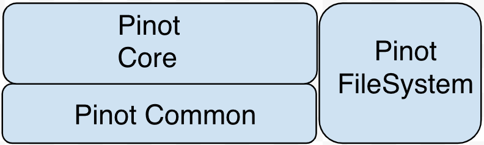
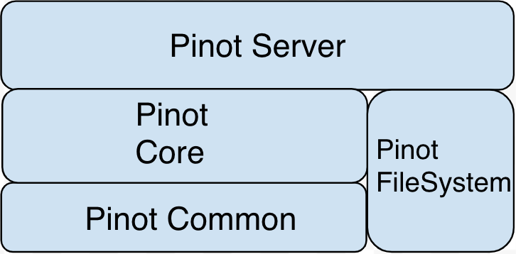
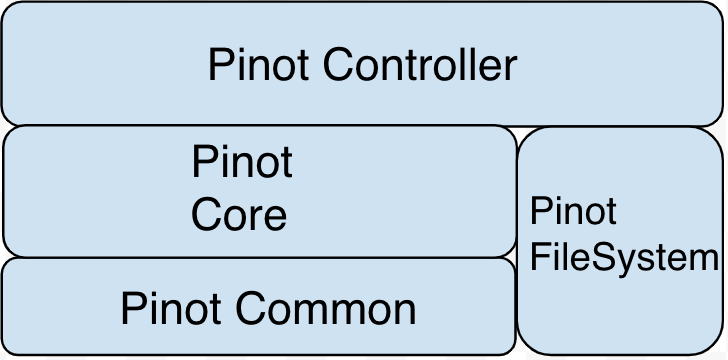
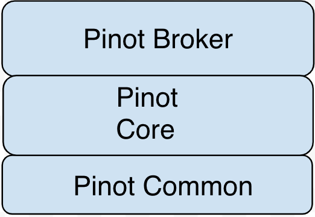
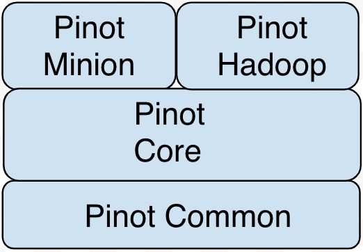

..
.. Licensed to the Apache Software Foundation (ASF) under one
.. or more contributor license agreements.  See the NOTICE file
.. distributed with this work for additional information
.. regarding copyright ownership.  The ASF licenses this file
.. to you under the Apache License, Version 2.0 (the
.. "License"); you may not use this file except in compliance
.. with the License.  You may obtain a copy of the License at
..
..   http://www.apache.org/licenses/LICENSE-2.0
..
.. Unless required by applicable law or agreed to in writing,
.. software distributed under the License is distributed on an
.. "AS IS" BASIS, WITHOUT WARRANTIES OR CONDITIONS OF ANY
.. KIND, either express or implied.  See the License for the
.. specific language governing permissions and limitations
.. under the License.
..

.. _code-modules:

*****************************
Code Modules and Organization
*****************************

.. contents:: Table of Contents

Before proceeding to contributing changes to Pinot, review the contents of this section.

External Dependencies
---------------------
Pinot depends on a number of external projects, the most notable ones are:

* Apache Zookeeper
* Apache Helix
* Apache Kafka
* Apache Thrift
* Netty
* Google Guava
* Yammer

*Helix* is used for ClusterManagement, and Pinot code is tightly integrated with Helix and Zookeeper interfaces.

*Kafka* is the default realtime stream provider, but can be replaced with others. See customizations section for more info.

*Thrift* is used for message exchange between broker and server components, with *Netty* providing the server functionality
for processing messages in a non-blocking fashion.

*Guava* is used for number of auxiliary components such as Caches and RateLimiters.
*Yammer* metrics is used to register and expose metrics from Pinot components.

In addition, Pinot relies on several key external libraries for some of its core functionality:
*Roaring Bitmaps*: Pinot's inverted indices are built using `this <https://github.com/RoaringBitmap/RoaringBitmap>`_ library.
*t-Digest*: Pinot's digest based percentile calculations are based on `this <https://github.com/tdunning/t-digest>`_ library.

Pinot Modules
-------------
Pinot is a multi-module project, with each module providing specific functionality that helps us to build services from
a combination of modules. This helps keep clean interface contracts between different modules as well as reduce the
overall executable size for individually deployable component.

Each module has a ``src/main/java`` folder where the code resides and ``src/test/java`` where the *unit* tests corresponding to
the module's code reside.

.. _pinot-foundation:

Foundational modules
--------------------
The following figure provides a high-level overview of the foundational Pinot modules.

pinot-common
^^^^^^^^^^^^
``pinot-common`` provides classes common to Pinot components. Some key classes you will find here are:

* ``config``: Definitions for various elements of Pinot's table config.
* ``metrics``: Definitions for base metrics provided by Controller, Broker and Server.

* ``metadata``: Definitions of metadata stored in Zookeeper.

* ``pql.parsers``: Code to compile PQL strings into corresponding AbstractSyntaxTrees (AST).
* ``request``: Autogenerated thrift classes representing various parts of PQL requests.
* ``response``: Definitions of response format returned by the Broker.
* ``filesystem`` provides abstractions for working with ``segments`` on local or remote filesystems. This module
allows for users to plugin filesystems specific to their usecase. Extensions to the base ``PinotFS`` should ideally be
housed in their specific modules so as not pull in unnecessary dependencies for all users.

pinot-transport
^^^^^^^^^^^^^^^
``pinot-transport`` module provides classes required to handle scatter-gather on Pinot Broker and netty wrapper classes
used by Server to handle connections from Broker.

pinot-core
^^^^^^^^^^
``pinot-core`` modules provides the core functionality of Pinot, specifically for handling segments, various index
structures, query execution - filters, transformations, aggregations etc and support for realtime segments.

pinot-server
^^^^^^^^^^^^
``pinot-server`` provides server specific functionality including server startup and REST APIs exposed by the server.

pinot-controller
^^^^^^^^^^^^^^^^
``pinot-server`` houses all the controller specific functionality, including many cluster administration APIs, segment
upload (for both offline and realtime), segment assignment, retention strategies etc.

pinot-broker
^^^^^^^^^^^^
``pinot-broker`` provides broker functionality that includes wiring the broker startup sequence, building broker routing
tables, PQL request handling.

pinot-minion
^^^^^^^^^^^^
``pinot-minion`` provides functionality for running auxiliary/periodic tasks on a Pinot Cluster such as purging records
for compliance with regulations like GDPR.

pinot-hadoop
^^^^^^^^^^^^
``pinot-hadoop`` provides classes for segment generation jobs using Hadoop infrastructure.

Auxiliary modules
-----------------
In addition to the core modules described above, Pinot code provides the following modules:

* ``pinot-tools``: This module is a collection of many tools useful for setting up Pinot cluster, creating/updating segments.
   It also houses the Pinot quick start guide code.

* ``pinot-perf``: This module has a collection of benchmark test code used to evaluate design options.

* ``pinot-client-api``: This module houses the Java client API. See :ref:`java-client` for more info.

* ``pinot-integration-tests``: This module holds integration tests that test functionality across multiple classes or components.

These tests typically do not rely on mocking and provide more end to end coverage for code.

.. _extension-modules:

Extension modules
-----------------
``pinot-hadoop-filesystem`` and ``pinot-azure-filesystem`` are module added to support extensions to Pinot filesystem.
The functionality is broken down into modules of their own to avoid polluting the common modules with additional large libraries.
These libraries bring in transitive dependencies of their own that can cause classpath conflicts at runtime. We would like to
avoid this for the common usage of Pinot as much as possible.
