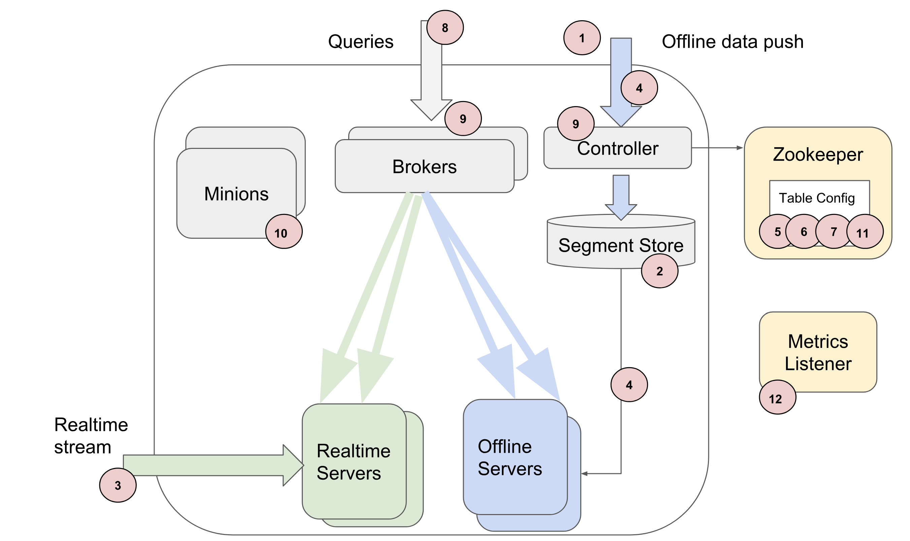

..
.. Licensed to the Apache Software Foundation (ASF) under one
.. or more contributor license agreements.  See the NOTICE file
.. distributed with this work for additional information
.. regarding copyright ownership.  The ASF licenses this file
.. to you under the Apache License, Version 2.0 (the
.. "License"); you may not use this file except in compliance
.. with the License.  You may obtain a copy of the License at
..
..   http://www.apache.org/licenses/LICENSE-2.0
..
.. Unless required by applicable law or agreed to in writing,
.. software distributed under the License is distributed on an
.. "AS IS" BASIS, WITHOUT WARRANTIES OR CONDITIONS OF ANY
.. KIND, either express or implied.  See the License for the
.. specific language governing permissions and limitations
.. under the License.
..

.. warning::  The documentation is not up-to-date and has moved to `Apache Pinot Docs <https://docs.pinot.apache.org/>`_.

.. _customizing-pinot:

Customizing Pinot
===================

There are a lot of places in Pinot which can be customized depending on the infrastructure or the use case. Below is a list of such customization points. 

1. Generating Pinot segments
^^^^^^^^^^^^^^^^^^^^^^^^^^^^
Typically, data files will be available on some offline data storage, such as HDFS, and a Hadoop job can be written to read the data and create the segment. The `SegmentCreationJob <https://github.com/apache/incubator-pinot/blob/master/pinot-hadoop/src/main/java/org/apache/pinot/hadoop/job/SegmentCreationJob.java>`_ class contains a hadoop job for creating segments. This is a map only job, and the mapper can be found in `SegmentCreationMapper <https://github.com/apache/incubator-pinot/blob/master/pinot-hadoop/src/main/java/org/apache/pinot/hadoop/job/mapper/SegmentCreationMapper.java>`_. You can override the SegmentCreationMapper with a custom mapper by overriding the ``SegmentCreationJob::getMapperClass()`` method. You can read more details about creating segments on Hadoop in :ref:`creating-segments`

Depending on how frequently new data is generated, you can schedule your jobs to run periodically using either cron or a scheduler such as `Azkaban <https://azkaban.github.io/>`_.

2. Pluggable storage
^^^^^^^^^^^^^^^^^^^^
We expect the storage to be shared across controllers of the same cluster, such as NFS. You can write your own implementation of PinotFS to store segments in a data layer of your choice, for example Azure or S3. Please refer to the :ref:`pluggable-storage` doc for more details.

3. Pluggable streams
^^^^^^^^^^^^^^^^^^^^
We provide out of the box support for consumption from Kafka stream. You can write your own plugin in order to consume from another pub-sub stream such as Azure EventHubs or Amazon Kinesis. Refer to the :ref:`pluggable-streams` doc for more details.  

4. Encrypting segments
^^^^^^^^^^^^^^^^^^^^^^
The `PinotCrypter <https://github.com/apache/incubator-pinot/blob/master/pinot-core/src/main/java/org/apache/pinot/core/crypt/PinotCrypter.java>`_ will encrypt and decrypt segments when they are uploaded to the controller or downloaded by the server. This class is especially useful in cases where segments cannot be stored unencrypted in storage. By default, we use `NoOpPinotCrypter <https://github.com/apache/incubator-pinot/blob/master/pinot-core/src/main/java/org/apache/pinot/core/crypt/NoOpPinotCrypter.java>`_ crypter which will not encrypt anything. 

You can write your own implementation by extending the ``org.apache.pinot.core.crypt.PinotCrypter`` interface in a similar fashion. The crypter can be used by passing the crypter class name in the header for the upload request as the header string ``CRYPTER``.

5. Segment assignment strategies
^^^^^^^^^^^^^^^^^^^^^^^^^^^^^^^^
We have various strategies for assigning segments to the available servers. These can be found under the `SegmentAssignmentStrategy <https://github.com/apache/incubator-pinot/blob/master/pinot-controller/src/main/java/org/apache/pinot/controller/helix/core/sharding/SegmentAssignmentStrategy.java>`_ interface. More details about which one to use depending on your usecase can be found in :ref:`tuning-pinot`. By default, the `BalanceNumSegmentAssignmentStrategy <https://github.com/apache/incubator-pinot/blob/master/pinot-controller/src/main/java/org/apache/pinot/controller/helix/core/sharding/BalanceNumSegmentAssignmentStrategy.java>`_ will be used. 

You can also write your own by implementing the ``org.apache.pinot.controller.helix.core.sharding.SegmentAssignmentStrategy`` interface. The segment assignment strategy can be configured for a table by setting it in the table config as 

.. code-block:: none

    {
        "segmentsConfig": {
            "segmentAssignmentStrategy": "BalanceNumSegmentAssignmentStrategy",
            ...
        }
    }

6. Data partitioning strategies
^^^^^^^^^^^^^^^^^^^^^^^^^^^^^^^
We have various algorithms to partition data during segment creation, as listed under the interface `PartitionFunction <https://github.com/apache/incubator-pinot/blob/master/pinot-core/src/main/java/org/apache/pinot/core/data/partition/PartitionFunction.java>`_. No partitioning is done by default. You can write your own partitioning function by implementing the interface for ``org.apache.pinot.segment.spi.PartitionFunction``. The partitioning function can be configured on the required columns in the table config as

.. code-block:: none

    {
         "segmentPartitionConfig": {
            "columnPartitionMap": {
                "userId": {
                    "functionName": "murmur",
                    "numPartitions": 10
                }
            }
        }
    }

7. Routing strategies
^^^^^^^^^^^^^^^^^^^^^
We have many routing strategies which you can find under the `RoutingTableBuilder <https://github.com/apache/incubator-pinot/blob/master/pinot-broker/src/main/java/org/apache/pinot/broker/routing/builder/RoutingTableBuilder.java>`_ interface. More details about which one to use depending on your usecase can be found in :ref:`tuning-pinot`. By default we will use `DefaultOfflineRoutingTableBuilder <https://github.com/apache/incubator-pinot/blob/master/pinot-broker/src/main/java/org/apache/pinot/broker/routing/builder/DefaultOfflineRoutingTableBuilder.java>`_ or the `DefaultRealtimeRoutingTableBuilder <https://github.com/apache/incubator-pinot/blob/master/pinot-broker/src/main/java/org/apache/pinot/broker/routing/builder/DefaultRealtimeRoutingTableBuilder.java>`_. 

You can write your own routing table builder by implementing the ``org.apache.pinot.broker.routing.builder.RoutingTableBuilder`` interface. The routing table builder can be set in the table config as 

.. code-block:: none

    {
	"routing": {
            "routingTableBuilderName": "PartitionAwareRealtime",
            "routingTableBuilderOptions": {}
        }
    }

8. Broker endpoint
^^^^^^^^^^^^^^^^^^
If you setup a usecase to have multiple brokers, you will have to develop your restful service to accept queries and distribute them across the brokers.

9. Access Control
^^^^^^^^^^^^^^^^^
Access control can be setup at various points in Pinot, such as controller endpoints and broker query endpoints. By default we will use `AllowAllAccessFactory <https://github.com/apache/incubator-pinot/blob/master/pinot-controller/src/main/java/org/apache/pinot/controller/api/access/AllowAllAccessFactory.java>`_ and hence not be enforcing any access controls. You can add access control by implementing the `AccessControlFactory <https://github.com/apache/incubator-pinot/blob/master/pinot-controller/src/main/java/org/apache/pinot/controller/api/access/AccessControlFactory.java>`_ interface. 

The access control factory can be configured in the controller configs by setting the fully qualified class name of the AccessControlFactory in the property
``controller.admin.access.control.factory.class``
The access control factory can be configured in the broker configs by setting the fully qualified class name of the AccessControlFactory in the property
``pinot.broker.access.control.class``
Any other properties required for initializing the factory can be set in the broker configs as properties with the prefix ``pinot.broker.access.control``.

10. Minion tasks 
^^^^^^^^^^^^^^^^
Minion tasks can be configured for background activities such as purging data, adding indexes, merging segments. The existing minion tasks can be found under the `PinotTaskExecutor <https://github.com/apache/incubator-pinot/blob/master/pinot-minion/src/main/java/org/apache/pinot/minion/executor/PinotTaskExecutor.java>`_ interface. You can create your own minion task by implementing the PinotTaskExecutor and the `PinotTaskExecutorFactory <https://github.com/apache/incubator-pinot/blob/master/pinot-minion/src/main/java/org/apache/pinot/minion/executor/PinotTaskExecutorFactory.java>`_ interfaces. The minion job can be configured to run for your table by setting the config in the table as 

.. code-block:: none

    {
         "task": {
            "taskTypeConfigsMap": {
              "PurgeTask": {}
            }
        }
    }

11. Custom configs
^^^^^^^^^^^^^^^^^^
Custom configs can be injected into Pinot by adding the customConfigs field in the table config. This field accepts key value pairs.

.. code-block:: none

    {
	"customConfigs": {
    	    "specialConfig": "testValue",
    	    "anotherSpecialConfig": "value"
        }
    }

12. Metrics 
^^^^^^^^^^^
We use `yammer MetricsRegistry <https://metrics.dropwizard.io/4.0.0/>`_ to collect metrics within our application components. These metrics can be published to a metrics server with the help of `MetricsRegistryRegistrationListener <https://github.com/apache/incubator-pinot/blob/master/pinot-common/src/main/java/org/apache/pinot/common/metrics/MetricsRegistryRegistrationListener.java>`_ interface. By default, we publish metrics to JMX using the `JmxReporterMetricsRegistryRegistrationListener <https://github.com/apache/incubator-pinot/blob/master/pinot-common/src/main/java/org/apache/pinot/common/metrics/JmxReporterMetricsRegistryRegistrationListener.java>`_. 

You can write a listener to publish metrics to another metrics server by implementing the  ``MetricsRegistryRegistrationListener`` interface. This listener can be injected into the controller by setting the fully qualified name of the class in the controller configs for the property ``pinot.controller.metrics.metricsRegistryRegistrationListeners``.

You would have to design your own systems to view and monitor these metrics. A list of all the metrics published for each component can be found in `ControllerMeter <https://github.com/apache/incubator-pinot/blob/master/pinot-common/src/main/java/org/apache/pinot/common/metrics/ControllerMeter.java>`_, `ControllerGauge <https://github.com/apache/incubator-pinot/blob/master/pinot-common/src/main/java/org/apache/pinot/common/metrics/ControllerGauge.java>`_, `BrokerMeter <https://github.com/apache/incubator-pinot/blob/master/pinot-common/src/main/java/org/apache/pinot/common/metrics/BrokerMeter.java>`_, `BrokerGauge <https://github.com/apache/incubator-pinot/blob/master/pinot-common/src/main/java/org/apache/pinot/common/metrics/BrokerGauge.java>`_, `ServerMeter <https://github.com/apache/incubator-pinot/blob/master/pinot-common/src/main/java/org/apache/pinot/common/metrics/ServerMeter.java>`_, `ServerGauge <https://github.com/apache/incubator-pinot/blob/master/pinot-common/src/main/java/org/apache/pinot/common/metrics/ServerGauge.java>`_, `MinionMeter <https://github.com/apache/incubator-pinot/blob/master/pinot-common/src/main/java/org/apache/pinot/common/metrics/MinionMeter.java>`_ and `MinionGauge <https://github.com/apache/incubator-pinot/blob/master/pinot-common/src/main/java/org/apache/pinot/common/metrics/MinionGauge.java>`_.

13. Deployables 
^^^^^^^^^^^^^^^
You can deploy pinot server, broker, controller and minion individually. You can either use out of the box jars and start the components via `PinotAdministrator <https://github.com/apache/incubator-pinot/blob/master/pinot-tools/src/main/java/org/apache/pinot/tools/admin/PinotAdministrator.java>`_, or run via scripts as described in the :ref:`getting-started`.

The starter classes for pinot controller, broker, server and minion are `ControllerStarter <https://github.com/apache/incubator-pinot/blob/master/pinot-controller/src/main/java/org/apache/pinot/controller/ControllerStarter.java>`_, `HelixBrokerStarter <https://github.com/apache/incubator-pinot/blob/master/pinot-broker/src/main/java/org/apache/pinot/broker/broker/helix/HelixBrokerStarter.java>`_, `HelixServerStarter <https://github.com/apache/incubator-pinot/blob/master/pinot-server/src/main/java/org/apache/pinot/server/starter/helix/HelixServerStarter.java>`_ and `MinionStarter <https://github.com/apache/incubator-pinot/blob/master/pinot-minion/src/main/java/org/apache/pinot/minion/MinionStarter.java>`_ respectively.

