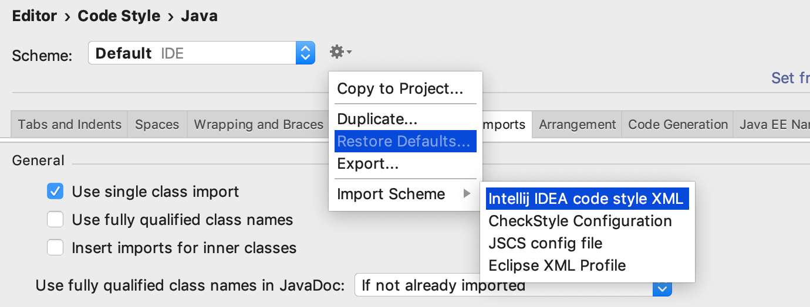
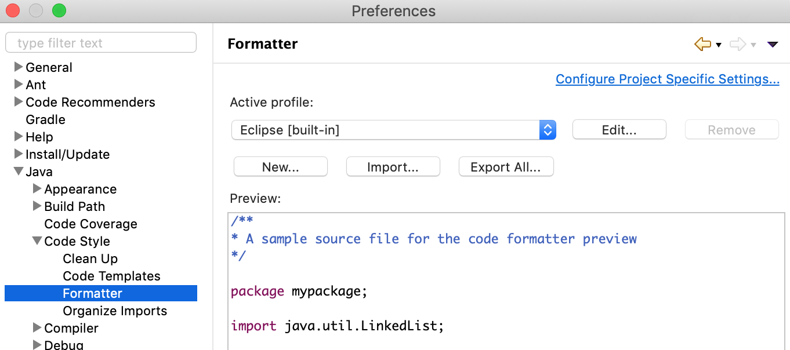

..
.. Licensed to the Apache Software Foundation (ASF) under one
.. or more contributor license agreements.  See the NOTICE file
.. distributed with this work for additional information
.. regarding copyright ownership.  The ASF licenses this file
.. to you under the Apache License, Version 2.0 (the
.. "License"); you may not use this file except in compliance
.. with the License.  You may obtain a copy of the License at
..
..   http://www.apache.org/licenses/LICENSE-2.0
..
.. Unless required by applicable law or agreed to in writing,
.. software distributed under the License is distributed on an
.. "AS IS" BASIS, WITHOUT WARRANTIES OR CONDITIONS OF ANY
.. KIND, either express or implied.  See the License for the
.. specific language governing permissions and limitations
.. under the License.
..

.. warning::  The documentation is not up-to-date and has moved to `Apache Pinot Docs <https://docs.pinot.apache.org/>`_.

.. _dev-setup:

*********************
Dev Environment Setup
*********************

.. contents:: Table of Contents

To contribute to Pinot, please follow the instructions below.

Git
---
Pinot uses git for source code management. If you are new to Git, it will be good to review `basics <https://git-scm.com/book/en/v1/Getting-Started-Git-Basics>`_ of Git and a common tasks like `managing branches <https://git-scm.com/book/en/v2/Git-Branching-Branches-in-a-Nutshell>`_ and `rebasing <https://git-scm.com/book/en/v2/Git-Branching-Rebasing>`_.

Getting the Source Code
-----------------------
Create a fork
^^^^^^^^^^^^^
To limit the number of branches created on the Apache Pinot repository, we recommend that you create a fork by clicking on the fork button `in this page <https://github.com/apache/incubator-pinot>`_.
Read more about `fork workflow here <https://www.atlassian.com/git/tutorials/comparing-workflows/forking-workflow>`_

Clone the repository locally
^^^^^^^^^^^^^^^^^^^^^^^^^^^^

.. code-block:: none

  $ mkdir workspace
  $ cd workspace
  $ git clone git@github.com:<github username>/pinot.git
  $ cd pinot
  # set upstream
  $ git remote add upstream https://github.com/apache/incubator-pinot
  # check that the upstream shows up correctly
  $ git remote -v

Maven
-----
Pinot is a Maven project and familiarity with Maven will help you work with Pinot code. If you are new to Maven, you can
read about Maven `here <maven.apache.org>`_ and `get a quick overview here <http://maven.apache.org/guides/getting-started/maven-in-five-minutes.html>`_.

Run the following maven command to setup the project.

.. code-block:: none

  # compile, download sources
  $mvn install package -DskipTests -Pbin-dist -DdownloadSources -DdownloadJavadocs

Setup IDE
---------
Import the project into your favorite IDE. Setup stylesheet according to your IDE. We have provided instructions for
intellij and eclipse. If you are using other IDEs, please ensure you use stylesheet based on
`this <https://github.com/apache/incubator-pinot/blob/master/config/codestyle-intellij.xml>`_.

Intellij
^^^^^^^^
To import the Pinot stylesheet this launch intellij and navigate to ``Preferences`` (on Mac) or ``Settings`` on Linux.

* Navigate to ``Editor`` -> ``Code Style`` -> ``Java``
* Select ``Import Scheme`` -> ``Intellij IDES code style XML``
* Choose ``codestyle-intellij.xml`` from ``incubator-pinot/config`` folder of your workspace. Click Apply.

* Pinot uses TestNG for unit testing, thus to enable intellij to use them, make sure you have the testNG plugin
installed and enabled.

Eclipse
^^^^^^^
To import the Pinot stylesheet this launch eclipse and navigate to ``Preferences`` (on Mac) or ``Settings`` on Linux.

* Navigate to Java->Code Style->Formatter
* Choose ``codestyle-eclipse.xml`` from ``incubator-pinot/config folder`` of your workspace. Click Apply.

