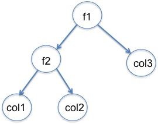
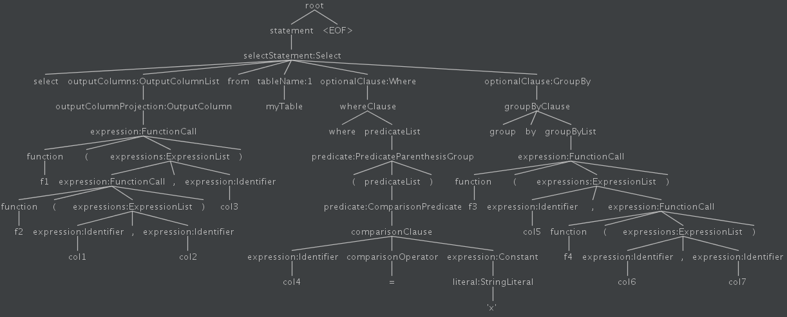
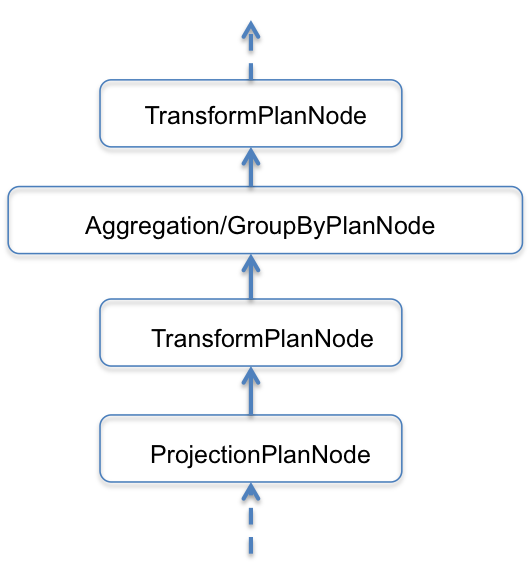

Expressions and UDFs
====================

Requirements
~~~~~~~~~~~~
The query language for Pinot (pql_) currently only supports *selection*, *aggregation* & *group by* operations on columns, and moreover, do not support nested operations. There are a growing number of use-cases of Pinot that require some sort of transformation on the column values, before and/or after performing *selection*, *aggregation* & *group by*. One very common example is when we would want to aggregate *metrics* over different granularity of times, without needing to pre-aggregate records on the individual granularity outside of Pinot. Another example would be when we would want to aggregate on *function* (say difference) of multiple columns.

The high level requirement here is to support *expressions* that represent a function on a set of columns in the queries, as opposed to just columns.

::

  select <exp1> from myTable where ... [group by <exp2>]

Where exp1 and exp2 can be of the form:

::

  func1(func2(col1, col2...func3(...)...), coln...)...

Proposal
~~~~~~~~

We first propose the concept of a Transform Operator (*xform*) below. We then propose using these *xform* operators to perform transformations before/after *selection*, *aggregation* and *group by* operations.

The *xform* operator takes following inputs:

#. An expression tree capturing *functions* and the *columns* they are applied on. The figure below shows one such tree for expression: ``f1(f2(col1, col2), col3)``
#. A set of document Id's on which to perform *xform*

The *xform* produces the following output:

* For each document Id in the input, it evaluates the specified expression, and produces one value.

  ** It is Many:1 for columns, i.e. many columns in the input produce one column value in the output.
  ** It is 1:1 for document Id's, i.e. for each document in the input, it produces one value in the output.

The *functions* in the *expression* can be either built-in into Pinot, or can be user-defined. We will discuss the mechanism for hooking up *UDF* and the manageability aspects in later sections.

Parser
~~~~~~

The PQL parser is already capable of parsing expressions in the *selection*, *aggregation* and *group by* sections. Following is a sample query containing expression, and its parse tree shown in the image.

::
  select f1(f2(col1, col2), col3) from myTable where (col4 = 'x') group by f3(col5, f4(col6, col7))

BrokerRequest
~~~~~~~~~~~~~

We convert the Parse Tree from the parser into what we refer to as *BrokerRequest*, which captures the parse tree along with other information and is serialized from Pinot broker to server.
While the parser does already recognize expressions in these sections, the *BrokerRequest* currently assumes these to be columns and not expressions. We propose the following enhancements here:

#. *BrokerRequest* needs to be enhanced to support not just *columns* but also *expressions* in the *selection*, *aggregation* & *group by* sections. *BrokerRequest* is currently implemented via 'Thrift'. We will need to enhance *request.thrift* to be able to support expressions. There are a couple of options here:

  * We use the same mechanism as *FilterQuery* (which is how the predicates are represented).
  * Evaluate other structures that may be more suitable for expression evaluation. (TBD).

#. The back-end of the parser generates *BrokerRequest* based on the parse tree of the query. We need to implement the functionality that takes the parse tree containing expressions in these sections and generates the new/enhanced *BrokerRequest* containing expressions.

Query Planning
~~~~~~~~~~~~~~

In the `query planning <https://github.com/linkedin/pinot/wiki/Query-Execution>`_ phase, Pinot server receives a *BrokerRequest* (per query) and parses it to build a query plan, where it hooks up various plan nodes for filtering, *Selection/Aggregation/GroupBy*, combining together.

A new *TransformPlanNode* class will be implemented that implements the *PlanNode* interface.
The query planning phase will be enhanced to include new *xform* plan nodes if the *BrokerRequest* contains *expressions* for *selection*, *aggregation* & *group by*. These plan nodes will get hooked up appropriately during planning phase.

Query Execution
~~~~~~~~~~~~~~~

In the query execution phase, the *run* method for *TransformPlanNode* will return a new *TransformOperator*. This operator is responsible for applying a transformation to a given set of documents, as specified by the *expression* in the query. The output *block* of this operator will be fed into other operators as per the query plan.

UDFs
~~~~

The functions in *expressions* can either be built-in functions in Pinot, or they can be user-defined. There are a couple of approaches for supporting hooking up of UDF's into Pinot:

#. If the function is generic enough and reusable by more than one clients, it might be better to include it as part of Pinot code base. In this case, the process for users would be to file a pull-request, which would then be reviewed and become part of Pinot code base.

#. Dynamic loading of user-defined functions:

  ** Users can specify jars containing their UDF's in the class path.
  ** List of UDF's can be specified in server config, and the server can ensure that it can find and load classes for each UDF specified in the config. This allows for a one-time static checking of availability of all specified UDF's.
  ** Alternatively, the server may do a dynamic check for each query to ensure all UDF's specified in the query are available and can be loaded.

Backward compatibility
~~~~~~~~~~~~~~~~~~~~~~

Given that this proposal requires modifying *BrokerRequest*, we are exposed to backward compatibility issues where  different versions of broker and server are running (one with the new feature and another without). We propose to address this as follows:

#. The changes to *BrokerRequest* to include *expressions* instead of *columns* would only take effect if a query containing *expression* is received. For the query just contains *columns* instead of *expressions*, we fall be to existing behavior and send the *columns* as they are being sent in the current design (ie not as a special case of an *expresion*).

#. This will warrant the following sequencing:
   ** Broker upgraded before server.
   ** New queries containing *expressions* should be sent only after both broker and server are upgraded.

Limitations
~~~~~~~~~~~

We see the following limitations in functionality currently:

#. Nesting of *aggregation* functions is not supported in the expression tree. This is because the number of documents after *aggregation* is reduced. In the expression below, *sum* of *col2* would yield one value, whereas *xform1* one *col1* would yield the same number of documents as in the input.

::

   sum(xform1(col1), sum(col2))

#. The current parser does not support precedence/associativity of operators, it just builds parse tree from left to right. Addressing this is outside of the scope of this project. Once the parser is enhanced to support this, *expression* evaluation within query execution would work correctly without any code changes required.
