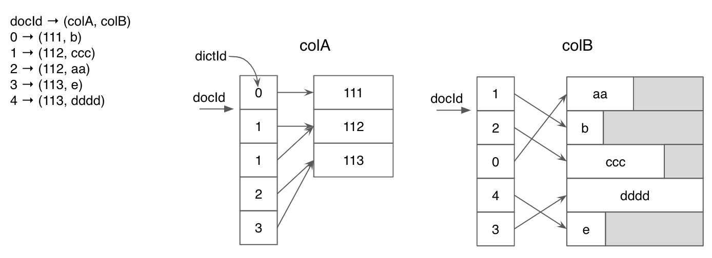
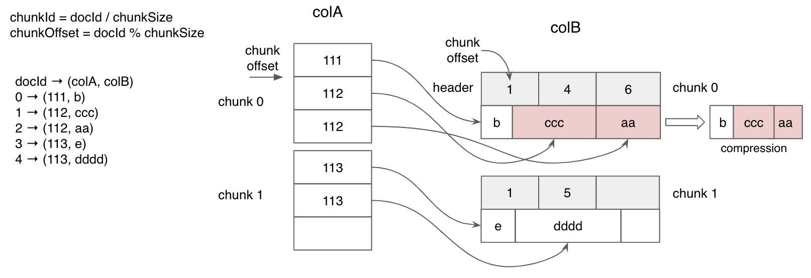
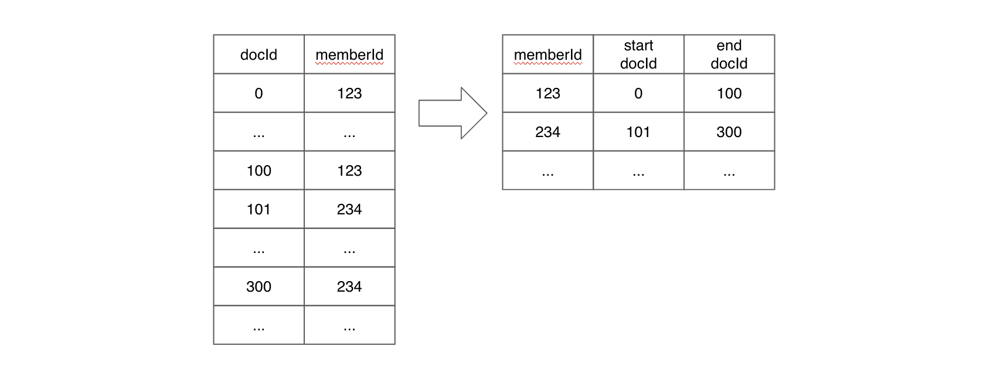
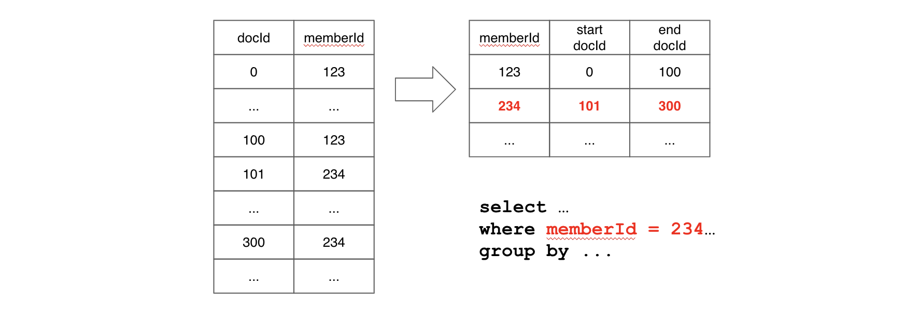

..
.. Licensed to the Apache Software Foundation (ASF) under one
.. or more contributor license agreements.  See the NOTICE file
.. distributed with this work for additional information
.. regarding copyright ownership.  The ASF licenses this file
.. to you under the Apache License, Version 2.0 (the
.. "License"); you may not use this file except in compliance
.. with the License.  You may obtain a copy of the License at
..
..   http://www.apache.org/licenses/LICENSE-2.0
..
.. Unless required by applicable law or agreed to in writing,
.. software distributed under the License is distributed on an
.. "AS IS" BASIS, WITHOUT WARRANTIES OR CONDITIONS OF ANY
.. KIND, either express or implied.  See the License for the
.. specific language governing permissions and limitations
.. under the License.
..

.. warning::  The documentation is not up-to-date and has moved to `Apache Pinot Docs <https://docs.pinot.apache.org/>`_.

.. TODO: add more details

Index Techniques
================

.. contents:: Table of Contents

Pinot currently supports the following index techniques, where each of them have their own advantages in different query
scenarios. By default, Pinot will use ``dictionary-encoded forward index`` for each column.

Forward Index
-------------

Dictionary-Encoded Forward Index with Bit Compression (Default)
~~~~~~~~~~~~~~~~~~~~~~~~~~~~~~~~~~~~~~~~~~~~~~~~~~~~~~~~~~~~~~~

For each unique value from a column, we assign an id to it, and build a dictionary from the id to the value. Then in the
forward index, we only store the bit-compressed ids instead of the values.

With few number of unique values, dictionary-encoding can significantly improve the space efficiency of the storage.

The below diagram shows the dictionary encoding for two columns with ``integer`` and ``string`` types. As seen in the
``colA``, dictionary encoding will save significant amount of space for duplicated values. On the other hand, ``colB`` 
has no duplicated data. Dictionary encoding will not compress much data in this case where there are a lot of unique
values in the column. For ``string`` type, we pick the length of the longest value and use it as the length for 
dictionary's fixed length value array. In this case, padding overhead can be high if there are a large number of unique 
values for a column.

Raw Value Forward Index
~~~~~~~~~~~~~~~~~~~~~~~

In contrast to the dictionary-encoded forward index, raw value forward index directly stores values instead of ids.

Without the dictionary, the dictionary lookup step can be skipped for each value fetch. Also, the index can take
advantage of the good locality of the values, thus improve the performance of scanning large number of values.

A typical use case to apply raw value forward index is when the column has a large number of unique values and the
dictionary does not provide much compression. As seen the above diagram for dictionary encoding, scanning values
with a dictionary involves a lot of random access because we need to perform dictionary look up. On the other hand, 
we can scan values sequentially with raw value forward index and this can improve performance a lot when applied 
appropriately.

Raw value forward index can be configured for a table by setting it in the table config as

.. code-block:: none

    {
        "tableIndexConfig": {
            "noDictionaryColumns": [
                "column_name",
                ...
            ],
            ...
        }
    }

Sorted Forward Index with Run-Length Encoding
~~~~~~~~~~~~~~~~~~~~~~~~~~~~~~~~~~~~~~~~~~~~~

When a column is physically sorted, Pinot uses a sorted forward index with run-length encoding on top of the 
dictionary-encoding. Instead of saving dictionary ids for each document id, we store a pair of start and end 
document id for each value. (The below diagram does not include dictionary encoding layer for simplicity.)

Sorted forward index has the advantages of both good compression and data locality. Sorted forward index can 
also be used as inverted index.

Sorted index can be configured for a table by setting it in the table config as

.. code-block:: none

    {
        "tableIndexConfig": {
            "sortedColumn": [
                "column_name"
            ],
            ...
        }
    }

Realtime server will sort data on ``sortedColumn`` when generating segment internally. For offline push, input data
needs to be sorted before running Pinot segment conversion and push job.

When applied correctly, one can find the following information on the segment metadata.

.. code-block:: none

    $ grep memberId <segment_name>/v3/metadata.properties | grep isSorted
    column.memberId.isSorted = true

Inverted Index (only available with dictionary-encoded indexes)
---------------------------------------------------------------

Bitmap Inverted Index
~~~~~~~~~~~~~~~~~~~~~

When inverted index is enabled for a column, Pinot maintains a map from each value to a bitmap, which makes value 
lookup to be constant time. When you have a column that is used for filtering frequently, adding an inverted index
will improve the performance greatly.

Inverted index can be configured for a table by setting it in the table config as

.. code-block:: none

    {
        "tableIndexConfig": {
            "invertedIndexColumns": [
                "column_name",
                ...
            ],
            ...
        }
    }

Sorted Inverted Index
~~~~~~~~~~~~~~~~~~~~~
Sorted forward index can directly be used as inverted index, with ``log(n)`` time lookup and it can benefit from data locality. 

For the below example, if the query has a filter on ``memberId``, Pinot will perform binary search on ``memberId`` values 
to find the range pair of docIds for corresponding filtering value. If the query requires to scan values for other columns
after filtering, values within the range docId pair will be located together; therefore, we can benefit a lot from data locality.

Sorted index performs much better than inverted index; however, it can only be applied to one column. When the query performance
with inverted index is not good enough and most of queries have a filter on a specific column (e.g. memberId), sorted index can
improve the query performance.

Advanced Index
--------------

Star-Tree Index
~~~~~~~~~~~~~~~

Unlike other index techniques which work on single column, Star-Tree index is built on multiple columns, and utilize the
pre-aggregated results to significantly reduce the number of values to be processed, thus improve the query performance.

Notes on Index Tuning
---------------------

If your use case is not site facing with a strict low latency requirement, inverted index will perform good enough for 
the most of use cases. We recommend to start with adding inverted index and if the query does not perform good enough,
a user can consider to use more advanced indices such as sorted column and star-tree index.

