LLC Design
==========

High Level Consumer
-------------------
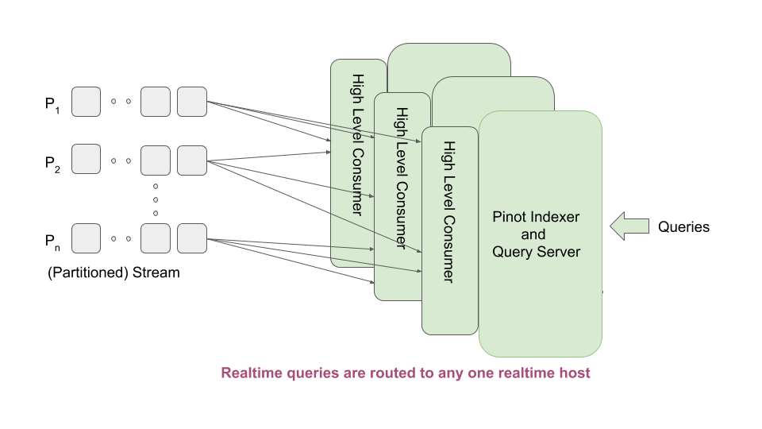

   High Level Stream Consumer Architecture

Low Level Consumer
------------------
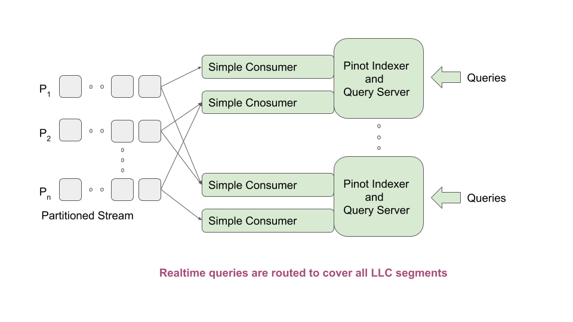

   Low Level Stream Consumer Architecture

The HighLevel Pinot consumer has the following properties:

* Each consumer needs to consume from all partitions. So, if we run one consumer in a host, we are limited by the capacity of that host to consume all partitions of the topic, no matter what the ingestion rate is.
    A stream may provide a way by which multiple hosts can consume the same topic, with each host receiving a subset of the messages. However in this mode the stream may duplicate rows that across the machines when the machines go down and come back up. Pinot cannot afford that.
* A stream consumer has no control over the messages that are received. As a result, the consumers may have more or less same segments, but not exactly the same. This makes capacity expansion etc.operationally heavy (e.g. start a consumer and wait 5 days before enabling it to serve queries). Having equivalent segments allows us to store the segments in the controller (like the offline segments) and download them onto a new server during capacity expansion, drastically reducing the operational time and effort.
    If we have common realtime segments across servers, it allows the brokers to use different routing algorithms (like we do with offline segments). Otherwise, the broker needs to route a query to exactly one realtime server so that we do not see duplicate data in results.

Design
------

When a table is created, the controller determines the number of partitions for the table, and "creates" one segment per partition, spraying these segments evenly across all the tagged servers. The following steps are done as a part of creating each segment:
* Segment metadata is created in Zookeeper. The segments are named as tableName__partitionNumber__segmentSeqNumber__Timestamp. For example: "myTable__6__0__20180801T1647Z"
* Segment metadata is set with the segment completion criteria -- the number of rows. The controller computes this number by dividing the rows threshold set in table configuration by the total number of segments of the table on the same server.
* Segment metadata is set with the offset from which to consume. Controller determines the offset by querying the stream.
* Table Idealstate is set with these segment names and the appropriate server instances thay are hosted. The state is set to CONSUMING
* Depending on the number of replicas set, each partition could be consumed in multiple servers.

When a server completes consuming the segment and reaches the end-criteria (either time or number of rows as per segment metadata), the server goes through a segment completion protocol sequence (described in diagrams below). The controller orchestrates all the replicas to reach the same consumption level, and allows one replica to "commit" a segment. The "commit" step involves:

* The server uploads the completed segment to the controller
* The controller updates that segments metadata to mark it completed, writes the end offset, end time, etc. in the metadata
* The controller creates a new segment for the same partition (e.g. "myTable__6__1__20180801T1805Z") and sets the metadata exactly like before, with the consumption offsets adjusted to reflect the end offset of the previous segmentSeqNumber.
* The controller updates the IdealState to change the state of the completing segment to ONLINE, and add the new segment in CONSUMING state.

As a first implementation, the end-criteria in the metadata points to the table config. It can be used at some point if we want to implement a more fancy end-criteria, perhaps based on traffic or other conditions, something that varies on a per-segment basis. The end-criteria could be number of rows, or time. If number of rows is specified, then the controller divides the specified number by the number of segments (of that table) on the same server, and sets the appropriate row threshold in the segment metadata. The consuming server simply obeys what is in segment metadata for row threshold.

We change the broker to introduce a new routing strategy that prefers ONLINE to CONSUMING segments, and ensures that there is at most one segment in CONSUMING state on a per partition basis in the segments that a query is to be routed to.

Important tuning parameters for Realtime Pinot
----------------------------------------------

* replicasPerPartition: This number indicates how many replicas are needed for each partition to be consumed from the stream
* realtime.segment.flush.threshold.size: This parameter should be set to the total number of rows of a topic that a realtime consuming server can hold in memory. Default value is 5M. If the value is set to 0, then the number of rows is automatically adjusted such that the size of the segment generated is as per the setting realtime.segment.flush.desired.size
* realtime.segment.flush.desired.size: Default value is "200M". The setting is used only if realtime.segment.flush.threshold.size is set to 0
* realtime.segment.flush.threshold.size.llc: This parameter overrides realtime.segment.flush.threshold.size. Useful when migrating live from HLC to LLC 
* pinot.server.instance.realtime.alloc.offheap: Default is false. Set it to true if you want off-heap allocation for dictionaries and no-dictionary column
* pinot.server.instance.realtime.alloc.offheap.direct: Default is false. Set it to true if you want off-heap allocation from DirectMemory (as opposed to MMAP)
* pinot.server.instance.realtime.max.parallel.segment.builds: Default is 0 (meaning infinite). Set it to a number if you want to limit number of segment builds. Segment builds take up heap memory, so it is useful to have a max setting and limit the number of simultaneous segment builds on a single server instance JVM.

Live migration of existing use cases from HLC to LLC
----------------------------------------------------

Preparation
~~~~~~~~~~~

* Set the new configurations as desired (replicasPerPartition, realtime.segment.flush.threshold.size.llc, realtime.segment.flush.threshold.time.llc). Note that the ".llc" versions of the configs are to be used only if you want to do a live migration of an existing table from HLC to LLC and need to have different thresholds for LLC than HLC.
* Set loadMode of segments to MMAP
* Set configurations to use offheap (either direct or MMAP) for dictionaries and no-dictinary items (realtime.alloc.offheap, realtime.alloc.offheap.direct)
* If your stream is Kafka, add ``stream.kafka.broker.list`` configurations for per-partition consumers
* Increase the heap size (doubling it may be useful) since we will be consuming both HLC and LLC on the same machines now. Restart the servers

Consuming the streams via both mechanisms
~~~~~~~~~~~~~~~~~~~~~~~~~~~~~~~~~~~~~~~~~

Configure two consumers but keep routing to be KafkaHighLevel

* Change the ``stream.<your stream here>.consumer.type`` setting to be ``highLevel,simple``. This starts both LLC and HLC consumers on the nodes.
* Change ``stream.<your stream here>.consumer.prop.auto.offset.reset`` to have the value largest (otherwise, llc consumers will start consuming from the beginning which may interfere with HLC operations)
* Check memory consumption and query response times.
* Set the broker routingTableuilderName to be ``KafkaHighLevel`` so that queries are not routed to LLC until consumption is caught up.
* Apply the table config
* Restart brokers and servers
* wait for retention period of the table.

Disabling HLC
~~~~~~~~~~~~~

* Change the ``stream.<your stream here>.consumer.type`` setting to be "simple"
* Remove the routingTableuilderName setting
* Apply the table configs and restart the brokers and servers
* The HLC segments will slowly age out on their own.

Migration from HLC to LLC with downtime
---------------------------------------

If it is all right to take a down time, then the easiest way is to disable the table, do the last step of the previous migration steps, and restart the table once the consumption has caught
up.

LLC Zookeeper setup and Segment Completion Protocol
---------------------------------------------------

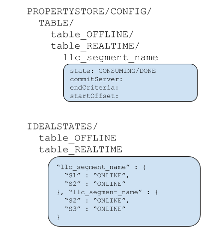

   Zookeeper setup

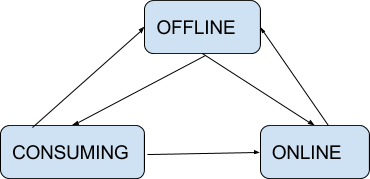

    Server-side Helix State Machine

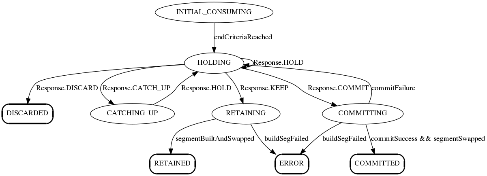

   Server-side Partition consumer state machine

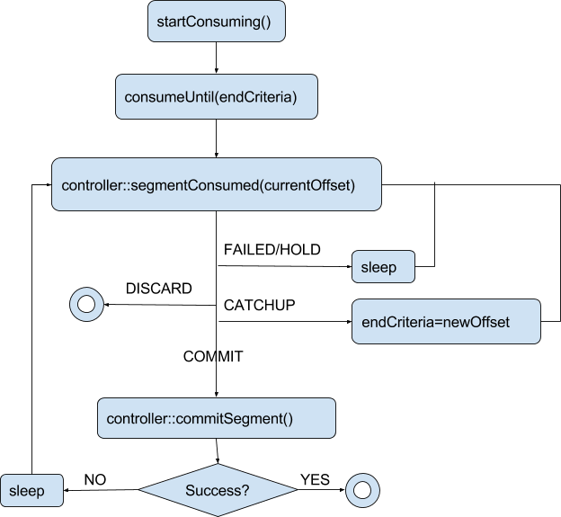

     Server-side control flow

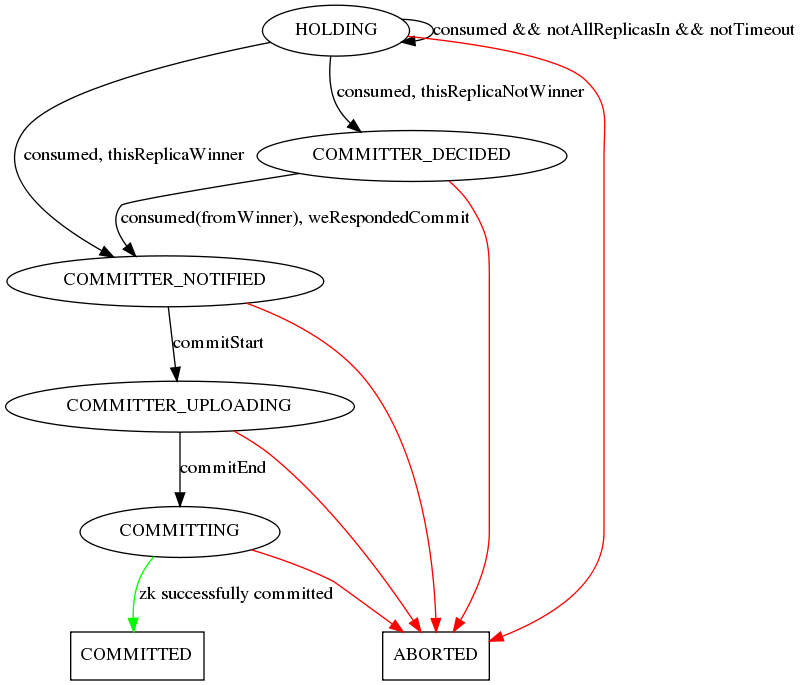

    Controller-side Segment completion state machine

Scenarios
~~~~~~~~~

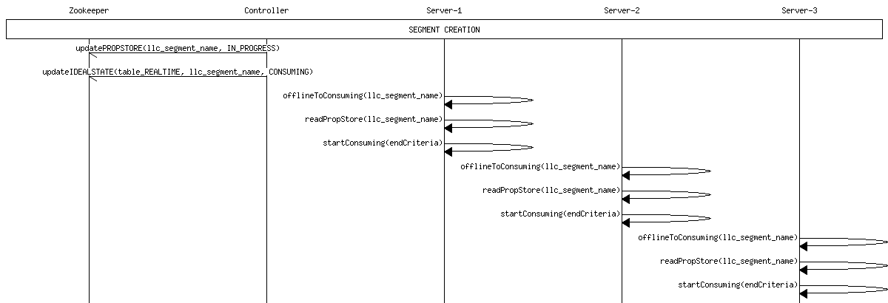

   Segment Creation

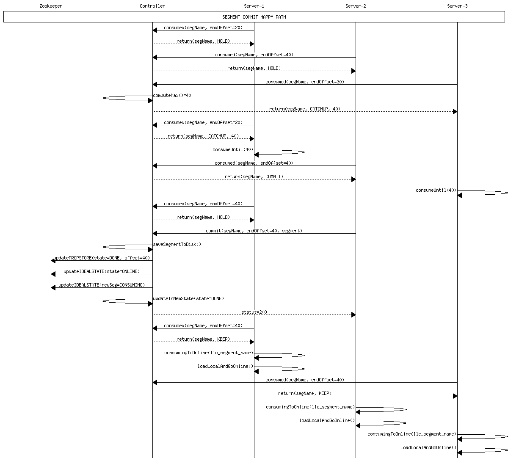

   Happy path commit 1

.. figure:: commit-happy-path-2.png

    Happy path commit 2

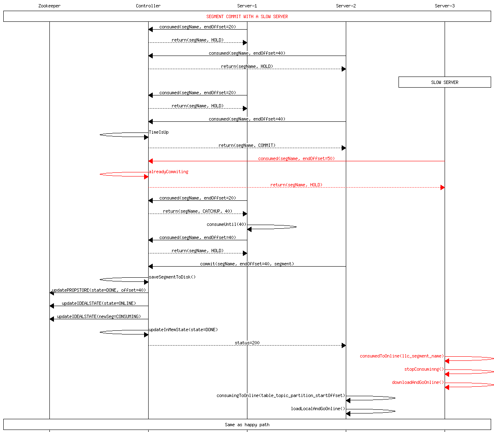

    Delayed Server

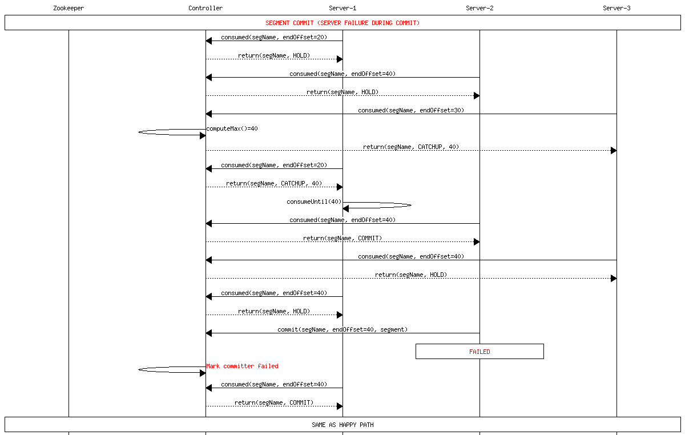

   Committer failure

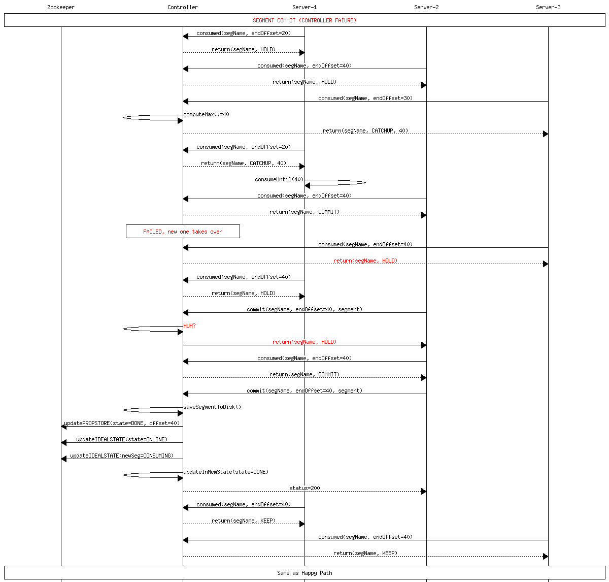

    Controller failure during commit

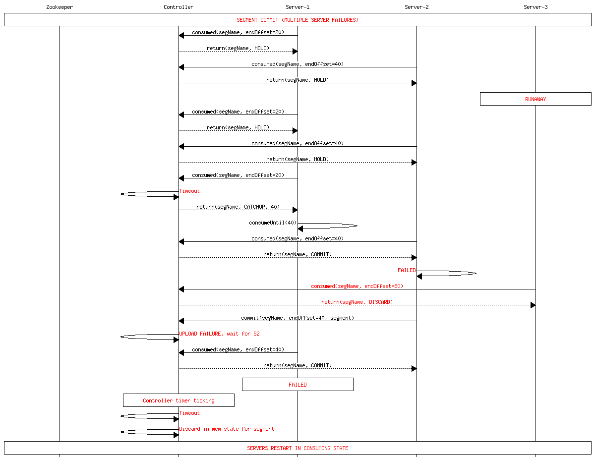

    Multiple failures
