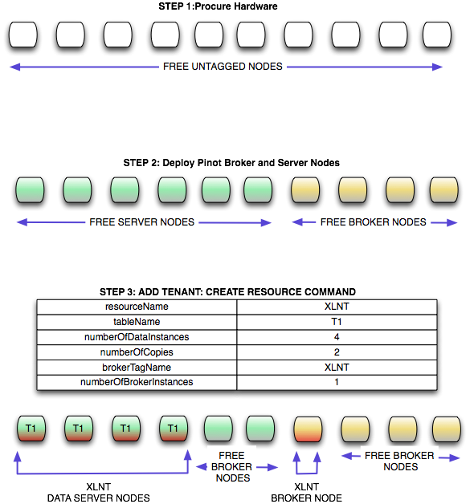

..
.. Licensed to the Apache Software Foundation (ASF) under one
.. or more contributor license agreements.  See the NOTICE file
.. distributed with this work for additional information
.. regarding copyright ownership.  The ASF licenses this file
.. to you under the Apache License, Version 2.0 (the
.. "License"); you may not use this file except in compliance
.. with the License.  You may obtain a copy of the License at
..
..   http://www.apache.org/licenses/LICENSE-2.0
..
.. Unless required by applicable law or agreed to in writing,
.. software distributed under the License is distributed on an
.. "AS IS" BASIS, WITHOUT WARRANTIES OR CONDITIONS OF ANY
.. KIND, either express or implied.  See the License for the
.. specific language governing permissions and limitations
.. under the License.
..

Multitenancy
============

Problems with Multiple cluster in Pinot 1.0
-------------------------------------------

In Pinot 1.0, we created one cluster for every engagement. While this was good in the beginning, it causes maintenance head aches and also delays on boarding new engagements.

Engagement
----------

Here is the typical process of on boarding a new engagement.

#.  Capacity planning, estimate the number of nodes needed.
#.  Place new hardware request and wait for allocation.
#.  Once we get the the hardware, tag the nodes and deploy the software

The above steps take time and every new engagement causes disruption for developers and engagements don't understand the process and feel that infrastructure team is slowing them down. Our goal is to drastically reduce the on boarding time on Pinot and also minimize the involvement from developers in on boarding new engagements.

Cluster Maintenance
-------------------

Even maintenance becomes harder as we have more number of clusters. Some of the problems with having multiple clusters

  *   Too many versions to manage. Lot of clusters continue to run with old version. When there is a bug, we upgrade one cluster because its urgent but never get to upgrade remaining clusters.
  *   Promotes per tenant configuration. Since each cluster can have its own tag based configuration. We end up having too many configuration parameters that are specific to a particular tenant.

Hardware utilization (cost to serve)
------------------------------------

Having separate set of hardware for every client means we cannot use the hardware in a cost effective manner. Most of the boxes in Pinot are under utilized and can easily support multiple use cases. However because of the way it is designed in Pinot 1.0, we end up creating separate clusters for each tenant. Co-locating multiple tenants on same hardware can reduce the number of boxes needed. While this is risky for external/site facing use cases, this can be used for internal use cases.

Multi tenancy in Pinot 2.0
--------------------------

In Pinot 2.0, we designed the system assuming that it will be Multi tenant from day 1\. We will have only one cluster for all tenants. Helix will be used to drive the multi tenancy in Pinot. The key ideas here are

#.  Unlike Pinot 1.0 where we order nodes on a per tenant basis, we order hardware in bulk. SRE will install the same software version on all boxes, these boxes will start up and register in Helix. This allows us the SRE's to configure and deploy the software on these boxes in one go.
#.  Make use of tagging feature provided by Helix. Helix allows one to Tag/untag a node dynamically. All instances are untagged when they join the cluster for the first time.
#.  On boarding a new engagement is as simple as tagging a node in Helix and assigning segments to the appropriate nodes in the cluster.

Example flow
------------

  *   Procure 100 nodes from Ops in the beginning of the quarter and deploy pinot code.
  *   All nodes will have the tag "untagged"
  *   Lets say we get an use case "XLNT". We do capacity planning and estimate that we need 10 nodes in total (Including replication factor). Pinot Controller automatically grabs 10 nodes from the pool and tags them as "XLNT". All segments arriving from Hadoop and real time segments will be assigned to one of these boxes.
  *   When we reach close to the capacity we get new hardware and add them to this cluster.

Cluster maintenance
-------------------

*   With this approach, all nodes in the cluster can be upgraded at once.
*   We might however some times want to upgrade only a set of machines. Current tooling at LinkedIn does not understand Helix metadata, hence we will write a small wrapper script that reads the information from Helix and upgrades the boxes that belong to a particular tenant.
*   Canary: we will tag some nodes as canary and deploy our golden data set on it. Every release will be first deployed to these canary nodes before deploying on rest of the nodes.

Monitoring
----------

*   With Pinot 1.0, we would have one in graph dashboard per tenant because we tag the nodes in svn when they are assigned to a tenant. With Pinot 2.0, we can dynamically assign a node to any tenant. This makes it hard to have a per tenant dashboard. We solve this problem by having a convention in naming our metrics. Every metric we log in Auto metrics will have tenant name as part of it. SRE can use regex feature in InGraphs to filter metrics that belong to a tenant and generate per tenent dashboard.
*   Metric naming convention: ``(pinot_server|pinot_broker|pinot_controller)_resourceName_tableName.metricName``

Pinot Broker
------------

In Pinot 1.0, we had embedded pinot broker within every pinot server. While this simplified deployment, it made it hard to capacity plan appropriately. Pinot broker and Pinot Server differ quite a bit in resource usage and workload patterns. Often, we wanted to add additional servers without increasing the number of brokers but this was not possible since adding a server meant adding additional broker as well. In pinot 2.0, we separated pinot-broker and pinot-server into separate deployable. Note: we can still deploy them together. This allowed us to make our brokers multi tenant. Unlike pinot-servers, in case of pinot-brokers we can make them truly multi tenant since they are state less. Especially for all internal use cases where Pinot serves as the back end for UI, the qps is pretty low and we can easily share brokers across multiple tenants.

Helix Layout
------------

All cluster state of Pinot is managed by `Helix <http://helix.apache.org>`_. The following links will help you understand the general layout of ZNodes in Helix.

  *   `ZNode Layout in Helix <https://cwiki.apache.org/confluence/display/HELIX/Zookeeper+Node+Layout>`_
  *   `Helix ZNode description <https://cwiki.apache.org/confluence/pages/viewpage.action?pageId=34013532#Design&Architecture-ZnodeStructure>`_

Pinot Cluster creation
----------------------

When the cluster is created the Zookeeper ZNode layout looks as follows.

.. figure:: img/znode_layout.png

Adding Nodes to cluster
-----------------------

Adding node to cluster can be done in two ways, manual or automatic. This is controlled by a property set in cluster config called "allowPariticpantAutoJoin". If this is set to true, participants can join the cluster when they are started. If not, they need to be pre-registered in Helix via `Helix Admin <http://helix.apache.org/0.6.4-docs/tutorial_admin.html>`_ command addInstance.

.. code-block:: none

  {
   "id" : "PinotPerfTestCluster",
   "simpleFields" : {
   "allowParticipantAutoJoin" : "true"
   },
   "mapFields" : { },
   "listFields" : { }
  }

In Pinot 2.0 we will set AUTO_JOIN to true. This means after the SRE's procure the hardware they can simply deploy the Pinot war and provide the cluster name. When the nodes start up, they join the cluster and registers themselves as server_untagged or broker_untagged. This is what one would see in Helix.

The znode ``CONFIGS/PARTICIPANT/ServerInstanceName`` looks lik below:

.. code-block:: none

    {
     "id":"Server_localhost_8098"
     ,"simpleFields":{
     "HELIX_ENABLED":"true"
     ,"HELIX_HOST":"Server_localhost"
     ,"HELIX_PORT":"8098"
     }
     ,"listFields":{
     "TAG_LIST":["server_untagged"]
     }
     ,"mapFields":{
     }
    }

And the znode ``CONFIGS/PARTICIPANT/BrokerInstanceName`` looks like below:

.. code-block:: none

    {
     "id":"Broker_localhost_8099"
     ,"simpleFields":{
     "HELIX_ENABLED":"true"
     ,"HELIX_HOST":"Broker_localhost"
     ,"HELIX_PORT":"8099"
     }
     ,"listFields":{
     "TAG_LIST":["broker_untagged"]
     }
     ,"mapFields":{
     }
    }

Adding Resources to Cluster
---------------------------

There is one resource idealstate created for Broker by default called broker_resource. This will contain the broker_tenant to broker assignment. Before creation of first a data resource, here is the content of brokerResource IdealState

*CLUSTERNAME/IDEALSTATES/BrokerResource (Broker IdealState before adding data resource)*

.. code-block:: none

  {
   "id" : "brokerResource",
   "simpleFields" : {
   "IDEAL_STATE_MODE" : "CUSTOMIZED",
   "MAX_PARTITIONS_PER_INSTANCE" : "2147483647",
   "NUM_PARTITIONS" : "2147483647",
   "REBALANCE_MODE" : "CUSTOMIZED",
   "REPLICAS" : "2147483647",
   "STATE_MODEL_DEF_REF" : "BrokerResourceOnlineOfflineStateModel",
   "STATE_MODEL_FACTORY_NAME" : "DEFAULT"
   },
   "mapFields" : { },
   "listFields" : { }
  }

After adding a resource using the following data resource creation command, a resource name XLNT will be created under IDEALSTATE znode. We will also tag one of server nodes as **server_XLNT** and 1 broker as **broker_XLNT.**

Sample Curl request
-------------------

.. code-block:: none

  curl -i -X POST -H 'Content-Type: application/json' -d '{"requestType":"create", "resourceName":"XLNT","tableName":"T1", "timeColumnName":"daysSinceEpoch", "timeType":"daysSinceEpoch","numberOfDataInstances":4,"numberOfCopies":2,"retentionTimeUnit":"DAYS", "retentionTimeValue":"700","pushFrequency":"daily", "brokerTagName":"XLNT", "numberOfBrokerInstances":1, "segmentAssignmentStrategy":"BalanceNumSegmentAssignmentStrategy", "resourceType":"OFFLINE", "metadata":{}}'

This is how it looks in Helix after running the above command.

The znode ``CONFIGS/PARTICIPANT/Broker_localhost_8099`` looks as follows:

.. code-block:: none

    {
     "id":"Broker_localhost_8099"
     ,"simpleFields":{
     "HELIX_ENABLED":"true"
     ,"HELIX_HOST":"Broker_localhost"
     ,"HELIX_PORT":"8099"
     }
     ,"listFields":{
     "TAG_LIST":["broker_mirrorProfileViewOfflineEvents1"]
     }
     ,"mapFields":{
     }
    }

And the znode ``IDEALSTATES/brokerResource`` looks like below after Data resource is created

.. code-block:: none

    {
     "id":"brokerResource"
     ,"simpleFields":{
     "IDEAL_STATE_MODE":"CUSTOMIZED"
     ,"MAX_PARTITIONS_PER_INSTANCE":"2147483647"
     ,"NUM_PARTITIONS":"2147483647"
     ,"REBALANCE_MODE":"CUSTOMIZED"
     ,"REPLICAS":"2147483647"
     ,"STATE_MODEL_DEF_REF":"BrokerResourceOnlineOfflineStateModel"
     ,"STATE_MODEL_FACTORY_NAME":"DEFAULT"
     }
     ,"listFields":{
     }
     ,"mapFields":{
     "mirrorProfileViewOfflineEvents1_O":{
     "Broker_localhost_8099":"ONLINE"
     }
     }
    }

Server Info in Helix

The znode ``CONFIGS/PARTICIPANT/Server_localhost_8098`` looks as below

.. code-block:: none

    {
     "id":"Server_localhost_8098"
     ,"simpleFields":{
     "HELIX_ENABLED":"true"
     ,"HELIX_HOST":"Server_localhost"
     ,"HELIX_PORT":"8098"
     }
     ,"listFields":{
     "TAG_LIST":["XLNT"]
     }
     ,"mapFields":{
     }
    }

And the znode ``/IDEALSTATES/XLNT (XLNT Data Resource IdealState)`` looks as below:

.. code-block:: none

    {
     "id":"XLNT"
     ,"simpleFields":{
     "IDEAL_STATE_MODE":"CUSTOMIZED"
     ,"INSTANCE_GROUP_TAG":"XLNT"
     ,"MAX_PARTITIONS_PER_INSTANCE":"1"
     ,"NUM_PARTITIONS":"0"
     ,"REBALANCE_MODE":"CUSTOMIZED"
     ,"REPLICAS":"1"
     ,"STATE_MODEL_DEF_REF":"SegmentOnlineOfflineStateModel"
     ,"STATE_MODEL_FACTORY_NAME":"DEFAULT"
     }
     ,"listFields":{}
     ,"mapFields":{ }
    }

Adding tables to Resources
--------------------------

Once the resource is created, we can create tables and upload segments accordingly.

Add a table to data resource
----------------------------

Sample Curl request

.. code-block:: none

    curl -i -X PUT -H 'Content-Type: application/json' -d '{"requestType":"addTableToResource","resourceName":"XLNT","tableName":"T1", "resourceType":"OFFLINE", "metadata":{}}' [http://CONTROLLER-HOST:PORT/dataresources](http://CONTROLLER-HOST:PORT/dataresources)

After the table is added, mapping between Resources and Tables are maintained in Helix Property Store (This is a place holder in Zookeeper provided by Helix to store application specific attributes).

The znode ``/PROPERTYSTORE/CONFIGS/RESOURCE/XLNT`` like like:

.. code-block:: none

    {
     "id":"mirrorProfileViewOfflineEvents1_O"
     ,"simpleFields":{
     "brokerTagName":"broker_mirrorProfileViewOfflineEvents1"
     ,"numberOfBrokerInstances":"1"
     ,"numberOfCopies":"1"
     ,"numberOfDataInstances":"1"
     ,"pushFrequency":"daily"
     ,"resourceName":"mirrorProfileViewOfflineEvents1"
     ,"resourceType":"OFFLINE"
     ,"retentionTimeUnit":"DAYS"
     ,"retentionTimeValue":"300"
     ,"segmentAssignmentStrategy":"BalanceNumSegmentAssignmentStrategy"
     ,"timeColumnName":"daysSinceEpoch"
     ,"timeType":"DAYS"
     }
     ,"listFields":{
     "tableName":["T1"]
     }
     ,"mapFields":{
     "metadata":{
     }
     }
    }
    //This will change slightly when retention properties
    //are stored at table scope </pre>

The znode ``/IDEALSTATES/XLNT (XLNT Data Resource IdealState)``

.. code-block:: none

    {
     "id":"XLNT_O"
     ,"simpleFields":{
     "IDEAL_STATE_MODE":"CUSTOMIZED"
     ,"INSTANCE_GROUP_TAG":"XLNT_O"
     ,"MAX_PARTITIONS_PER_INSTANCE":"1"
     ,"NUM_PARTITIONS":"3"
     ,"REBALANCE_MODE":"CUSTOMIZED"
     ,"REPLICAS":"1"
     ,"STATE_MODEL_DEF_REF":"SegmentOnlineOfflineStateModel"
     ,"STATE_MODEL_FACTORY_NAME":"DEFAULT"
     }
     ,"listFields":{
     }
     ,"mapFields":{
     "XLNT_T1_daily_2014-08-01_2014-08-01_0":{
     "Server_localhost_8098":"ONLINE"
     }
     ,"XLNT_T1_daily_2014-08-01_2014-08-01_1":{
     "Server_localhost_8098":"ONLINE"
     }
     ,"XLNT_T1_daily_2014-08-01_2014-08-01_2":{
     "Server_localhost_8098":"ONLINE"
     }
     }
    }

