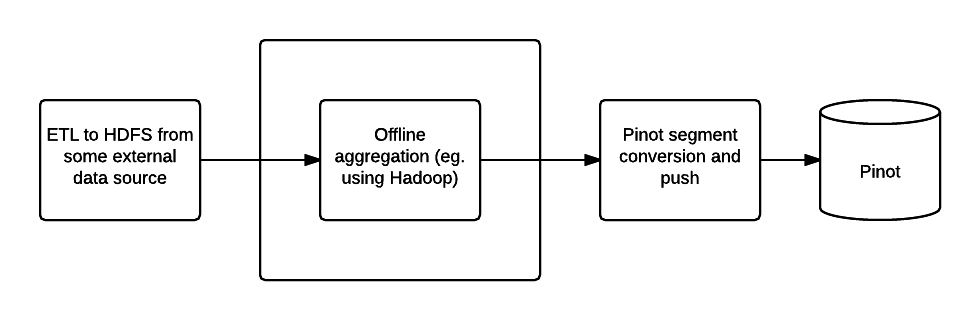

Creating Pinot segments in Hadoop
=================================

Pinot index files can be created offline on Hadoop, then pushed onto a production cluster. Because index generation does not happen on the Pinot nodes serving traffic, this means that these nodes can continue to serve traffic without impacting performance while data is being indexed. The index files are then pushed onto the Pinot cluster, where the files are distributed and loaded by the server nodes with minimal performance impact.

  Offline Pinot workflow

To create index files offline  a Hadoop workflow can be created to complete the following steps:

1. Pre-aggregate, clean up and prepare the data, writing it as Avro format files in a single HDFS directory
2. Create the index files
3. Upload the index files to the Pinot cluster

Step one can be done using your favorite tool (such as Pig, Hive or Spark), while Pinot provides two MapReduce jobs to do step two and three.

Configuration
-------------

Create a job properties configuration file, such as one below:

::

  # === Index segment creation job config ===

  # path.to.input: Input directory containing Avro files
  path.to.input=/user/pinot/input/data

  # path.to.output: Output directory containing Pinot index segments
  path.to.output=/user/pinot/output

  # path.to.schema: Schema file for the table, stored locally
  path.to.schema=flights-schema.json

  # segment.table.name: Name of the table for which to generate index segments
  segment.table.name=flights

  # === Segment tar push job config ===
  
  # push.to.hosts: Comma separated list of controllers host names to which to push
  push.to.hosts=controller_host_0,controller_host_1

  # push.to.port: The port on which the controller runs
  push.to.port=8888

Index file creation
-------------------

The Pinot Hadoop module contains a job that you can incorporate into your
workflow to generate Pinot indices. Note that this will only create data for you. 
In order to have this data on your cluster, you want to also run the SegmentTarPush
job, details below. To run SegmentCreation through the command line:

::

  mvn clean install -DskipTests -Pbuild-shaded-jar
  hadoop jar pinot-hadoop-0.016-shaded.jar SegmentCreation job.properties

Index file push
---------------

This job takes generated Pinot index files from an input directory and pushes
them to a Pinot controller node.

::

  mvn clean install -DskipTests -Pbuild-shaded-jar
  hadoop jar pinot-hadoop-0.016-shaded.jar SegmentTarPush job.properties

