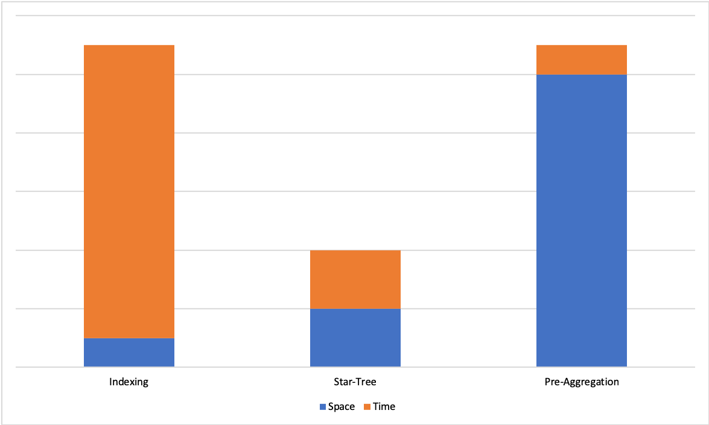
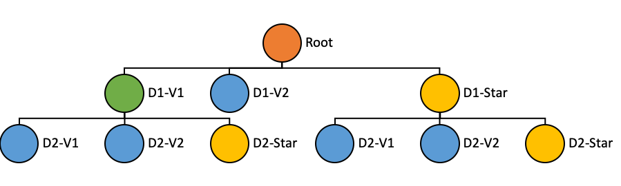
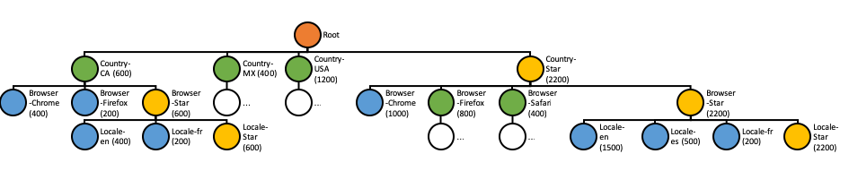

Star-Tree: A Specialized Index for Fast Aggregations
====================================================

One of the biggest challenges in realtime OLAP systems is achieving and maintaining tight SLA’s on latency and
throughput on large data sets.

Existing techniques such as sorted index or inverted index help improve query latencies, but speed-ups are still limited
by number of documents necessary to process for computing the results. On the other hand, pre-aggregating the results
ensures a constant upper bound on query latencies, but can lead to storage space explosion.

Here we introduce **Star-Tree** index to utilize the pre-aggregated documents in a smart way to achieve low query
latencies but also use the storage space efficiently for aggregation/group-by queries.

Existing Solutions
------------------

Consider the following data set as an example to discuss the existing approaches:

========= ========= ======== =============
 Country   Browser   Locale   Impressions
========= ========= ======== =============
CA        Chrome    en       400
CA        Firefox   fr       200
MX        Safari    es       300
MX        Safari    en       100
USA       Chrome    en       600
USA       Firefox   es       200
USA       Firefox   en       400
========= ========= ======== =============

Sorted Index
~~~~~~~~~~~~

In this approach, data is sorted on a primary key, which is likely to appear as filter in most queries in the query set.

This reduces the time to search the documents for a given primary key value from linear scan *O(n)* to binary search
*O(logn)*, and also keeps good locality for the documents selected.

While this is a good improvement over linear scan, there are still a few issues with this approach:

- While sorting on one column does not require additional space, sorting on additional columns would require additional
  storage space to re-index the records for the various sort orders.

- While search time is reduced from *O(n)* to *O(logn)*, overall latency is still a function of total number of
  documents need to be processed to answer a query.

Inverted Index
~~~~~~~~~~~~~~

In this approach, for each value of a given column, we maintain a list of document id’s where this value appears.

Below are the inverted indexes for columns ‘Browser’ and ‘Locale’ for our example data set:

========= ========
 Browser   Doc Id
========= ========
Firefox   1,5,6
Chrome    0,4
Safari    2,3
========= ========

======== ========
 Locale   Doc Id
======== ========
en       0,3,4,6
es       2,5
fr       1
======== ========

For example, if we want to get all the documents where ‘Browser’ is ‘Firefox’, we can simply look up the inverted index
for ‘Browser’ and identify that it appears in documents [1, 5, 6].

Using inverted index, we can reduce the search time to constant time *O(1)*. However, the query latency is still a
function of the selectivity of the query, i.e. increases with the number of documents need to be processed to answer the
query.

Pre-aggregation
~~~~~~~~~~~~~~~

In this technique, we pre-compute the answer for a given query set upfront.

In the example below, we have pre-aggregated the total impressions for each country:

========= =============
 Country   Impressions
========= =============
CA        600
MX        400
USA       1200
========= =============

Doing so makes answering queries about total impressions for a country just a value lookup, by eliminating the need of
processing a large number of documents. However, to be able to answer with multiple predicates implies pre-aggregating
for various combinations of different dimensions. This leads to exponential explosion in storage space.

Star-Tree Solution
------------------

On one end of the spectrum we have indexing techniques that improve search times with limited increase in space, but do
not guarantee a hard upper bound on query latencies. On the other end of the spectrum we have pre-aggregation techniques
that offer hard upper bound on query latencies, but suffer from exponential explosion of storage space.



   Space-Time Trade Off Between Different Techniques

We propose the Star-Tree data structure that offers a configurable trade-off between space and time and allows us to
achieve hard upper bound for query latencies for a given use case. In the following sections we will define the
Star-Tree data structure, and discuss how it is utilized within Pinot for achieving low latencies with high throughput.

Definition
~~~~~~~~~~

Tree Structure
``````````````

Star-Tree is a tree data structure that is consisted of the following properties:



   Star-Tree Structure

- **Root Node** (Orange):
  Single root node, from which the rest of the tree can be traversed.

- **Leaf Node** (Blue):
  A leaf node can containing at most *T* records, where *T* is configurable.

- **Non-leaf Node** (Green):
  Nodes with more than *T* records are further split into children nodes.

- **Star-Node** (Yellow):
  Non-leaf nodes can also have a special child node called the Star-Node. This node contains the pre-aggregated records
  after removing the dimension on which the data was split for this level.

- **Dimensions Split Order** ([D1, D2]):
  Nodes at a given level in the tree are split into children nodes on all values of a particular dimension. The
  dimensions split order is an ordered list of dimensions that is used to determine the dimension to split on for a
  given level in the tree.

Node Properties
```````````````

The properties stored in each node are as follows:

- **Dimension**:
  The dimension which the node is split on

- **Start/End Document Id**:
  The range of documents this node points to

- **Aggregated Document Id**:
  One single document which is the aggregation result of all documents pointed by this node

Index Generation
~~~~~~~~~~~~~~~~

Star-Tree index is generated in the following steps:

- The data is first projected as per the *dimensionsSplitOrder*. Only the dimensions from the split order are reserved,
  others are dropped. For each unique combination of reserved dimensions, metrics are aggregated per configuration. The
  aggregated documents are written to a file and served as the initial Star-Tree documents (separate from the original
  documents).

- Sort the Star-Tree documents based on the *dimensionsSplitOrder*. It is primary-sorted on the first dimension in this
  list, and then secondary sorted on the rest of the dimensions based on their order in the list. Each node in the tree
  points to a range in the sorted documents.

- The tree structure can be created recursively (starting at root node) as follows:

  - If a node has more than *T* records, it is split into multiple children nodes, one for each value of the dimension
    in the split order corresponding to current level in the tree.

  - A Star-Node can be created (per configuration) for the current node, by dropping the dimension being split on, and
    aggregating the metrics for rows containing dimensions with identical values. These aggregated documents are
    appended to the end of the Star-Tree documents.

    If there is only one value for the current dimension, Star-Node won't be created because the documents under the
    Star-Node are identical to the single node.

- The above step is repeated recursively until there are no more nodes to split.

- Multiple Star-Trees can be generated based on different configurations (*dimensionsSplitOrder*, *aggregations*, *T*)

Aggregation
~~~~~~~~~~~

Aggregation is configured as a pair of aggregation function and the column to apply the aggregation.

All types of aggregation function with bounded-sized intermediate result are supported.

Supported Functions
```````````````````

- COUNT
- MIN
- MAX
- SUM
- AVG
- MINMAXRANGE
- DISTINCTCOUNTHLL
- PERCENTILEEST
- PERCENTILETDIGEST

Unsupported Functions
`````````````````````

- DISTINCTCOUNT:
  Intermediate result *Set* is unbounded

- PERCENTILE:
  Intermediate result *List* is unbounded

Index Generation Configuration
~~~~~~~~~~~~~~~~~~~~~~~~~~~~~~
Multiple index generation configurations can be provided to generate multiple Star-Trees. Each configuration should
contain the following properties:

- **dimensionsSplitOrder**:
  An ordered list of dimension names can be specified to configure the split order. Only the dimensions in this list are
  reserved in the aggregated documents. The nodes will be split based on the order of this list. For example, split at
  level *i* is performed on the values of dimension at index *i* in the list.

- **skipStarNodeCreationForDimensions** (Optional, default empty):
  A list of dimension names for which to not create the Star-Node.

- **functionColumnPairs**:
  A list of aggregation function and column pairs (split by double underscore "__").
  E.g. **SUM__Impressions** (*SUM* of column *Impressions*)

- **maxLeafRecords** (Optional, default 10000):
  The threshold *T* to determine whether to further split each node.

Example
~~~~~~~

For our example data set, with the following example configuration, the tree and documents should be something like
below.

StarTreeIndexConfig
```````````````````

.. code-block:: json

   {
     "dimensionsSplitOrder": [
       "Country",
       "Browser",
       "Locale"
     ],
     "skipStarNodeCreationForDimensions": [],
     "functionColumnPairs": [
       "SUM__Impressions"
     ],
     "maxLeafRecords": 1
   }

Tree Structure
``````````````
The values in the parentheses are the aggregated sum of *Impressions* for all the documents under the node.



   Star-Tree Example

Star-Tree documents
```````````````````

========= ========= ======== ==================
 Country   Browser   Locale   SUM__Impressions
========= ========= ======== ==================
CA        Chrome    en       400
CA        Firefox   fr       200
MX        Safari    en       100
MX        Safari    es       300
USA       Chrome    en       600
USA       Firefox   en       400
USA       Firefox   es       200
CA        \*        en       400
CA        \*        fr       200
CA        \*        \*       600
MX        Safari    \*       400
USA       Firefox   \*       600
USA       \*        en       1000
USA       \*        es       200
USA       \*        \*       1200
\*        Chrome    en       1000
\*        Firefox   en       400
\*        Firefox   es       200
\*        Firefox   fr       200
\*        Firefox   \*       800
\*        Safari    en       100
\*        Safari    es       300
\*        Safari    \*       400
\*        \*        en       1500
\*        \*        es       500
\*        \*        fr       200
\*        \*        \*       2200
========= ========= ======== ==================

Query Execution
~~~~~~~~~~~~~~~

For query execution, the idea is to first check metadata to determine whether the query can be solved with the Star-Tree
documents, then traverse the Star-Tree to identify documents that satisfy all the predicates. After applying any
remaining predicates that were missed while traversing the Star-Tree to the identified documents, apply
aggregation/group-by on the qualified documents.


The algorithm to traverse the tree can be described as follows:

- Start from root node.

- For each level, what child node(s) to select depends on whether there are any predicates/group-by on the split
  dimension for the level in the query.

  - If there is no predicate or group-by on the split dimension, select the Star-Node if exists, or all child nodes to
    traverse further.

  - If there are predicate(s) on the split dimension, select the child node(s) that satisfy the predicate(s).

  - If there is no predicate, but there is a group-by on the split dimension, select all child nodes except Star-Node.

- Recursively repeat the previous step until all leaf nodes are reached, or all predicates are satisfied.

- Collect all the documents pointed to by the selected nodes.

  - If all predicates and group-bys are satisfied, pick the single aggregated document from each selected node.

  - Otherwise, collect all the documents in the document range from each selected node.
