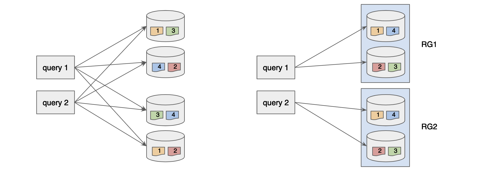
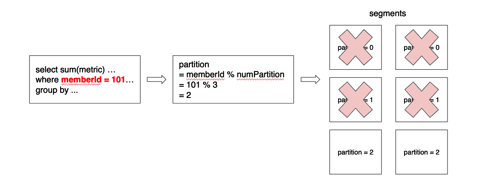

..
.. Licensed to the Apache Software Foundation (ASF) under one
.. or more contributor license agreements.  See the NOTICE file
.. distributed with this work for additional information
.. regarding copyright ownership.  The ASF licenses this file
.. to you under the Apache License, Version 2.0 (the
.. "License"); you may not use this file except in compliance
.. with the License.  You may obtain a copy of the License at
..
..   http://www.apache.org/licenses/LICENSE-2.0
..
.. Unless required by applicable law or agreed to in writing,
.. software distributed under the License is distributed on an
.. "AS IS" BASIS, WITHOUT WARRANTIES OR CONDITIONS OF ANY
.. KIND, either express or implied.  See the License for the
.. specific language governing permissions and limitations
.. under the License.
..

Optimizing Scatter and Gather
=============================

.. contents:: Table of Contents

When the use case has very high qps along with low latency requirements (usually site facing use cases), 
we need to consider optimizing the scatter-and-gather.

Below table summarizes the two issues with the default behavior of Pinot.

.. csv-table:: 
   :header: "Problem", "Impact", "Solution"
   :widths: 15, 15, 15

   "Querying all servers", "Bad tail latency, not scalable", "Control the number of servers to fan out"
   "Querying all segments", "More CPU work on server", "Minimize the number of segment"

Querying All Servers
--------------------
By default, Pinot uses ``BalanceNumSegmentAssignmentStrategy`` for segment assignment. This scheme tries to distribute 
the number of segments uniformly to all servers. When we perform scatter-and-gather a query request, broker will try 
to uniformly distribute the workload among servers by assigning the balanced number of segments to each server. As 
a result, each query will span out to all servers under this scheme. It works pretty well when qps is low and you 
have small number of servers in the cluster. However, as we add more servers or have more qps, the probability of 
hitting slow server (e.g. gc) increases steeply and Pinot will suffer from a long tail latency. 

In order to address this issue, we have introduced a concept of ``Replica Group``, which allows us to control the 
number of servers to fan out for each query.

Replica Group Segment Assignment and Query Routing
^^^^^^^^^^^^^^^^^^^^^^^^^^^^^^^^^^^^^^^^^^^^^^^^^^

``Replica Group`` is a set of server that contains a 'complete' set of all segments of a table. Once we assign the 
segment based on replica group, each query can be answered by fanning out to a replica group instead of all servers.

``Replica Group`` based segment assignment can be configured for a table by setting it in the table config. Note that 
``ReplicaGroupSegmentAssignmentStrategy`` needs to be used along with ``PartitionAwareOffline`` for routing and this is 
currently available for **offline table** only.

.. code-block:: none

    {
        "segmentsConfig": {
            ...
            "replication": "3",
            "segmentAssignmentStrategy": "ReplicaGroupSegmentAssignmentStrategy",
            "replicaGroupStrategyConfig": {
                "mirrorAssignmentAcrossReplicaGroups": true,
                "numInstancesPerPartition": 4
            }
        }
        ...
        "routing": {
            "routingTableBuilderName": "PartitionAwareOffline",
            "routingTableBuilderOptions": {}
        },
        ...
    }

As seen above, you can use ``replication`` and ``numInstancesPerPartition`` to control the number of servers to span. For 
instance, let's say that you have 12 servers in the cluster. Above configuration will generate 3 replica groups (based on 
``replication=3``) and each replica group will contain 4 servers (``numInstancesPerPartition=4``). In this example, each 
query will span to a single replica group (4 servers). 

As you seen above, replica group gives you the control on the number of servers to span for each query. When you try to
decide the proper number of ``replication`` and ``numInstancesPerPartition``, you should consider the trade-off between
throughput and latency. Given a fixed number of servers, increasing ``replication`` factor while decreasing 
``numInstancesPerPartition`` will give you more throughput because each server requires to process less number of queries. 
However, each server will need to process more number of segments per query, thus increasing overall latency. Similarly,
decreasing ``replication`` while increasing ``numInstancesPerPartition`` will make each server processing more number
of queries but each server needs to process less number of segments per query. So, this number has to be decided based 
on the use case requirements.

Querying All Segments
---------------------

By default, Pinot broker will distribute all segments for query processing and segment pruning is happening in Server.
In other words, Server will look at the segment metadata such as min/max time value and discard the segment if it does 
not contain any data that the query is asking for. Server side pruning works pretty well when the qps is low; however,
it becomes the bottleneck if qps is very high (hundreds to thousands queries per second) because unnecessary segments 
still need to be scheduled for processing and consume cpu resources.

Currently, we have two different mechanisms to prune segments on the broker side to minimize the number of segment for
processing before scatter-and-gather.

Partitioning
^^^^^^^^^^^^
When the data is partitioned on a dimension, each segment will contain all the rows with the same partition value for
a partitioning dimension. In this case, a lot of segments can be pruned if a query requires to look at a single
partition to compute the result. Below diagram gives the example of data partitioned on member id while the query
includes an equality filter on member id. 

``Partitoning`` can be enabled by setting the following configuration in the table config.

.. code-block:: none

    {
        "tableIndexConfig": {
            "segmentPartitionConfig": {
                "columnPartitionMap": {
                    "memberId": {
                        "functionName": "modulo",
                        "numPartitions": 4
                    }
                }
            }
        }
        ...
        "routing": {
            "routingTableBuilderName": "PartitionAwareOffline",
            "routingTableBuilderOptions": {}
        },
    }

Pinot currently supports ``modulo`` and ``murmur`` hash function. After setting the above config, data needs to be partitioned
using the same partition function and the number of partition to partition before running Pinot segment conversion and push job 
for offline push. Realtime partitioning depends on the kafka for partitioning. When emitting an event to kafka, a user need to 
feed partitioning key and partition function for Kafka producer API.

When applied correctly, partition information should be available in the segment metadata.

.. code-block:: none

    $ column.memberId.partitionFunction = Murmur
    column.memberId.partitionValues = [9 9]

Note that broker side pruning for partitioning only works with ``PartitionAwareOffline`` and ``PartitionAwareRealtime`` routing
table builder strategies. Also note that the current implementation for partitioning only works for **EQUALITY** filter 
(e.g. memberId = xx).

Bloom Filter for Dictionary
^^^^^^^^^^^^^^^^^^^^^^^^^^^
Dictionary encoding provides the array of unique values. Pinot allows to create a bloom filter on this unique values for each 
column. Bloom filter can quickly determine whether the value exist in the segment.

Bloom filter can be enabled by setting the following configuration in the table config.

.. code-block:: none

    {
        "tableIndexConfig": {
            "bloomFilterColumns": [
                "column_name",
                ...
            ],
            ...
        }
    }

Our implementation limits the size of bloom filter to be less than 1MB per segment along with max false positive of 5% to 
avoid consuming too much memory. We recommend to put bloom filter for the column with ``less than 1 million cardinality``.

Note that the current implementation for bloom filter also works for **EQUALITY** filter only.