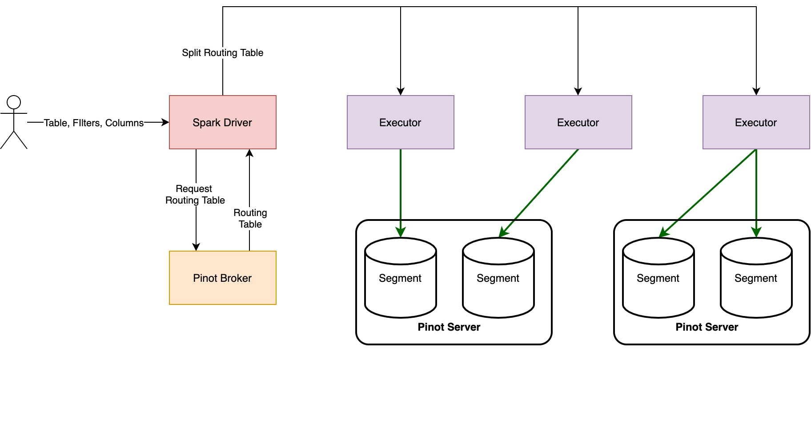

<!--

    Licensed to the Apache Software Foundation (ASF) under one
    or more contributor license agreements.  See the NOTICE file
    distributed with this work for additional information
    regarding copyright ownership.  The ASF licenses this file
    to you under the Apache License, Version 2.0 (the
    "License"); you may not use this file except in compliance
    with the License.  You may obtain a copy of the License at

      http://www.apache.org/licenses/LICENSE-2.0

    Unless required by applicable law or agreed to in writing,
    software distributed under the License is distributed on an
    "AS IS" BASIS, WITHOUT WARRANTIES OR CONDITIONS OF ANY
    KIND, either express or implied.  See the License for the
    specific language governing permissions and limitations
    under the License.

-->
# Read Model

Connector can scan offline, hybrid and realtime tables. Base two options <`table` and `tableType`> parameters have to given like below;
- For offline table: `table: tbl`, `tableType: OFFLINE or offline`
- For realtime table `table: tbl`, `tableType: REALTIME or realtime`
- For hybrid table `table: tbl`, `tableType: HYBRID or hybrid`

An example scan;

```scala
val df = spark.read
      .format("pinot")
      .option("table", "airlineStats")
      .option("tableType", "offline")
      .load()
```

Custom schema can be specified directly. If schema is not specified, connector read table schema from Pinot controller, and then convert to the Spark schema. 

### Architecture

Connector reads data from `Pinot Servers` directly. For this operation, firstly, connector creates query with given filters(if filter push down is enabled) and columns, then finds routing table for created query. It creates pinot splits that contains **ONE PINOT SERVER and ONE OR MORE SEGMENT per spark partition**, based on the routing table and `segmentsPerSplit`(detailed explain is defined below). Lastly, each partition read data from specified pinot server in parallel.



Each Spark partition open connection with Pinot server, and read data. For example, assume that routing table informations for specified query is like that:

```
- realtime ->
   - realtimeServer1 -> (segment1, segment2, segment3)
   - realtimeServer2 -> (segment4)
- offline ->
   - offlineServer10 -> (segment10, segment20)
```

If `segmentsPerSplit` is equal to 3, there will be created 3 Spark partition like below;

| Spark Partition  | Queried Pinot Server/Segments |
| ------------- | ------------- |
| partition1  | realtimeServer1 / segment1, segment2, segment3  |
| partition2  | realtimeServer2 / segment4  |
| partition3  | offlineServer10 / segment10, segment20 |

If `segmentsPerSplit` is equal to 1, there will be created 6 Spark partition;

| Spark Partition  | Queried Pinot Server/Segments |
| ------------- | ------------- |
| partition1  | realtimeServer1 / segment1 |
| partition2  | realtimeServer1 / segment2  |
| partition3  | realtimeServer1 / segment3 |
| partition4  | realtimeServer2 / segment4 |
| partition5  | offlineServer10 / segment10 |
| partition6  | offlineServer10 / segment20 |

If `segmentsPerSplit` value is too low, that means more parallelism. But this also mean that a lot of connection will be opened with Pinot servers, and will increase QPS on the Pinot servers. 

If `segmentsPerSplit` value is too high, that means less parallelism. Each Pinot server will scan more segments per request.  

**Note:** Pinot servers prunes segments based on the segment metadata when query comes. In some cases(for example filtering based on the some columns), some servers may not return data. Therefore, some Spark partitions will be empty. In this cases, `repartition()` may be applied for efficient data analysis after loading data to Spark.

### Filter And Column Push Down
Connector supports filter and column push down. Filters and columns are pushed to the pinot servers. Filter and column push down improves the performance while reading data because of its minimizing data transfer between Pinot and Spark. In default, filter push down enabled. If filters are desired to be applied in Spark, `usePushDownFilters` should be set as `false`.

Connector uses SQL, as a result all sql filters are supported. 

### Segment Pruning

Connector receives routing table of given query to get information on which Pinot servers to will be queried and which segments will be scan. If partitioning is enabled for given Pinot table, and created query in Spark will be scan the specific partitions, only required Pinot server and segment informations will be got(that means segment pruning operation will be applied before data reading like Pinot brokers). For more information; [Optimizing Scatter and Gather in Pinot](https://docs.pinot.apache.org/operators/operating-pinot/tuning/routing#optimizing-scatter-and-gather)

### Table Querying
Connector uses SQL to query Pinot tables.

Connector creates realtime and offline queries based on the filters and required columns. 
- If queried table type is `OFFLINE` or `REALTIME`, routing table information will be got for specific table type. 
- If queried table type is `HYBRID`, realtime and offline routing table information will be got. Also, connector receives `TimeBoundary` information for given table, and use it in query to ensure that the overlap between realtime and offline segment data is queried exactly once. For more information; [Pinot Broker](https://docs.pinot.apache.org/basics/components/broker)

### Query Generation

Example generated queries for given usages(assume that `airlineStats` table is hybrid and TimeBoundary information is `DaysSinceEpoch, 16084`); 

```scala
val df = spark.read
      .format("pinot")
      .option("table", "airlineStats")
      .option("tableType", "hybrid")
      .load()
```

For above usage, realtime and offline SQL queries will be created;

- Offline query: `select * from airlineStats_OFFLINE where DaysSinceEpoch < 16084 LIMIT {Int.MaxValue}`

- Realtime query: `select * from airlineStats_REALTIME where DaysSinceEpoch >= 16084 LIMIT {Int.MaxValue}`

```scala
val df = spark.read
      .format("pinot")
      .option("table", "airlineStats")
      .option("tableType", "offline")
      .load()
      .filter($"DestStateName" === "Florida")
      .filter($"Origin" === "ORD")
      .select($"DestStateName", $"Origin", $"Carrier")
```

- Offline query: `select DestStateName, Origin, Carrier from airlineStats_OFFLINE where DestStateName = 'Florida and Origin = 'ORD' LIMIT {Int.MaxValue}`

**Note: Limit is added to every query. Because, generated queries will be converted to the Pinot `BrokerRequest` class. In this operation, pinot sets limit to `10` automatically. Therefore, `LIMIT` was set to `Int.MaxValue` to prevent this issue.**

### Connector Read Parameters
| Configuration  | Description | Required | Default Value |
| ------------- | ------------- | ------------- | ------------- |
| table | Pinot table name without table type | Yes | - |
| tableType | Pinot table type(`realtime`, `offline` or `hybrid`) | Yes | - |
| controller | Pinot controller url and port. Input should be `url:port` format without schema. Connector does not support `https` schema for now. | No | localhost:9000 |
| broker | Pinot broker url and port. Input should be `url:port` format without schema. If not specified, connector will find broker instances of table automatically. Connector does not support `https` schema for now | No | Fetch broker instances of table from Pinot Controller | 
| usePushDownFilters | Push filters to pinot servers or not. If true, data exchange between pinot server and spark will be minimized. | No | true |
| segmentsPerSplit | Represents the maximum segment count that will be scanned by pinot server in one connection | No | 3 | 
| pinotServerTimeoutMs | The maximum timeout(ms) to get data from pinot server | No | 10 mins |
| useGrpcServer | Boolean value to enable reads via gRPC. This option is more memory efficient both on Pinot server and Spark executor side because it utilizes streaming. Requires gRPC to be enabled on Pinot server. | No | false |
| queryOptions | Comma separated list of Pinot query options (e.g. "enableNullHandling=true,skipUpsert=true") | No | "" |