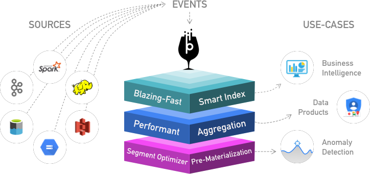

Apache Pinot is a realtime distributed OLAP datastore, which is used to deliver scalable real time analytics with low latency. It can ingest data from batch data sources (such as HDFS, S3, Azure Data Lake, Google Cloud Storage) as well as streaming sources (such as Kafka). Pinot is designed to scale horizontally, so that it can scale to larger data sets and higher query rates as needed.



## When should I use it?

Pinot is designed to answer OLAP queries with low latency. It is suited in contexts where fast analytics, such as aggregations, are needed on immutable data, possibly, with real-time data ingestion.

## When should I not use it?

Pinot is not a replacement for your database, nor a search engine. It addresses fast analytics on immutable data and it is not thought by design, to handle data updates or deletions. Joins are currently not supported, but this problem can be overcome by using [PrestoDB]((https://prestodb.io/)) for querying Pinot.

For more information about PrestoDB connector for Pinot see the [Helm Chart of Pinot with Presto](https://github.com/apache/incubator-pinot/tree/master/kubernetes/examples/helm#access-pinot-using-presto)
Pinot-Presto connector is avilable with version [0.229](https://github.com/prestodb/presto/pull/13504)

## Quick example

Pinot works very well for querying time series data with lots of Dimensions and Metrics.
Filters and aggregations are easy and fast.

```SQL
SELECT sum(clicks), sum(impressions) FROM AdAnalyticsTable
  WHERE ((daysSinceEpoch >= 17849 AND daysSinceEpoch <= 17856)) AND accountId IN (123456789)
  GROUP BY daysSinceEpoch TOP 100
```

## Who uses Pinot?

Pinot powers several big players, including LinkedIn, Uber, Factual, Weibo, Slack and more..