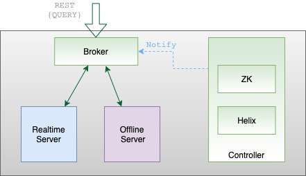

import Alert from '@site/src/components/Alert';
import Tabs from '@theme/Tabs';
import TabItem from '@theme/TabItem';

Brokers are the components that handle Pinot queries. They accept queries from clients and forward them to the right servers. They collect results back from the servers and consolidate them into a single response, to sent it back to the client.

