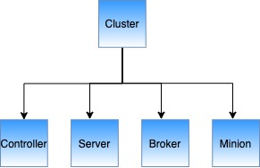

import Alert from '@site/src/components/Alert';
import Tabs from '@theme/Tabs';
import TabItem from '@theme/TabItem';

Cluster is a set a nodes comprising of servers, brokers, controllers and minions.

Pinot leverages [Apache Helix](http://helix.apache.org) for cluster management. Helix is a cluster management framework to manage replicated, partitioned resources in a distributed system. Helix uses Zookeeper to store cluster state and metadata.



## Cluster components

Briefly, Helix divides nodes into three logical components based on their responsibilities

### Participant

The nodes that host distributed, partitioned resources

### Spectator

The nodes that observe the current state of each Participant and use that information to access the resources. Spectators are notified of state changes in the cluster (state of a participant, or that of a partition in a participant).

### Controller

The node that observes and controls the Participant nodes. It is responsible for coordinating all transitions in the cluster and ensuring that state constraints are satisfied while maintaining cluster stability.

- Pinot Servers are modeled as Participants, more details about server nodes can be found in [Server](../../docs/components/server)
- Pinot Brokers are modeled as Spectators, more details about broker nodes can be found in [Broker](../../docs/components/broker)
- Pinot Controllers are modeled as Controllers, more details about controller nodes can be found in [Controller](../../docs/components/controller)

## Logical view

Another way to visualize the cluster is a logical view, wherein a cluster contains [tenants](../../docs/components/segments), tenants contain [tables](../../docs/components/tables), and tables contain [segments](../../docs/components/segments).


## Setup a Pinot Cluster

Typically, there is only cluster per environment/data center. There is no needed to create multiple Pinot clusters since Pinot supports the concept of [tenants](../../docs/components/tenants).

At LinkedIn, the largest Pinot cluster consists of 1000+ nodes.

To setup a Pinot cluster, we need to first start Zookeeper:

<Tabs
  className="Install"
  defaultValue="Using launcher scripts"
  values={[
    { label: <><i className="Using docker images"></i> Using docker images</>, value: 'docker', },
    { label: <><i className="Using launcher scripts"></i> Using launcher scripts</>, value: 'launcer', },
  ]
}>

<TabItem value="docker">

1. Create a Network
Create an isolated bridge network in docker

```bash
docker network create -d bridge pinot-demo
```

2. Start Zookeeper

Start Zookeeper in daemon.

```bash
docker run \
    --network=pinot-demo \
    --name pinot-zookeeper \
    --restart always \
    -p 2181:2181 \
    -d zookeeper:3.5.6
```

3. Start Zookeeper UI
Start  ZKUI to browse Zookeeper data at http://localhost:9090.

```bash
docker run \
    --network pinot-demo --name=zkui \
    -p 9090:9090 \
    -e ZK_SERVER=pinot-zookeeper:2181 \
    -d qnib/plain-zkui:latest
```

4. 

</TabItem>

<TabItem value="launcer">

Download Pinot Distribution using instructions in Download

Start Zookeeper

```bash
bin/pinot-admin.sh StartZookeeper
```

2. Start Zooinspector

Install [zooinspector](https://github.com/jfim/zooinspector) to view the data in Zookeeper, and connect to localhost:2181

</TabItem>

</Tabs>

Once we've started Zookeeper, we can start other components to join this cluster. If you're using docker, pull the latest `apachepinot/pinot` image. 

### Using docker images

#### Pull pinot docker image

(Optional) You can also follow the instructions here to build your own images.<br />

You can try out pre-built Pinot all-in-one docker image.

```sql
export PINOT_VERSION=0.3.0-SNAPSHOT
export PINOT_IMAGE=apachepinot/pinot:${PINOT_VERSION}
docker pull ${PINOT_IMAGE}
```

To start other components to join the cluster

- Start Controller
- Start Broker
- Start Server

Explore your cluster via Pinot Data Explorer
