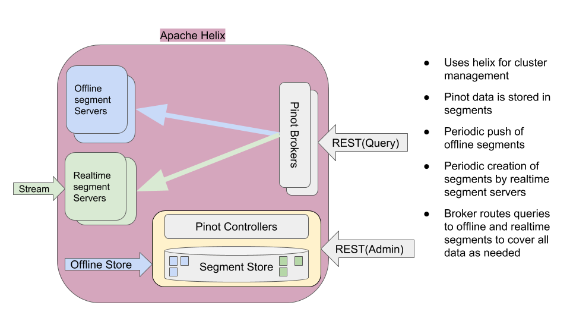

- Terminology: 
First, a bit of naming notions. Pinot has has different components, and different ways of representing the data. In particular, data is represented by:

- Table: 
A table is a logical abstraction to refer to a collection of related data. It consists of columns and rows (documents).

- Segment: 
Data in table is divided into (horizontal) shards referred to as segments.

