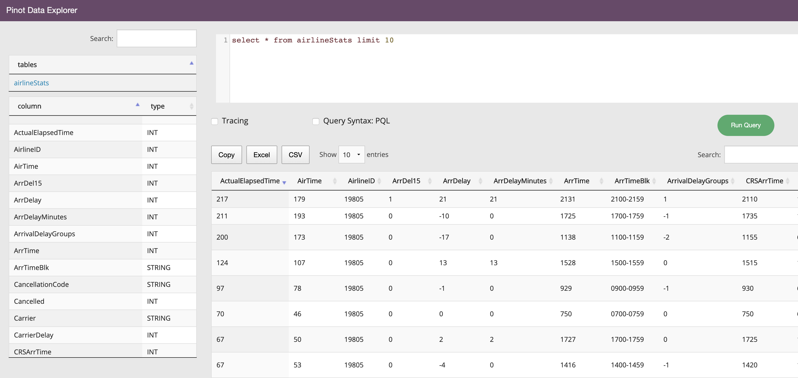

import Alert from '@site/src/components/Alert';
import Tabs from '@theme/Tabs';
import TabItem from '@theme/TabItem';

## REST API on the Broker

Pinot can be queried via a broker endpoint as follows. This example assumes broker is running on `localhost:8099`

<Tabs
  block={true}
  defaultValue="Standard-SQL endpoint"
  urlKey="arch"
  values={[{"label":"Standard-SQL endpoint","value":"Standard-SQL endpoint"},{"label":"PQL endpoint","value":"PQL endpoint"}]}>

<TabItem value="Standard-SQL endpoint">

The Pinot REST API can be accessed by invoking POST operation with a JSON body containing the parameter sql to the `/query/sql` endpoint on a broker.

```sql
$ curl -H "Content-Type: application/json" -X POST \
   -d '{"sql":"select foo, count(*) from myTable group by foo limit 100"}' \
   http://localhost:8099/query/sql
```

</TabItem>

<TabItem value="PQL endpoint">

<Alert type="info"> This endpoint is deprecated, and will soon be removed. The standard-SQL endpoint is the recommended endpoint.
</Alert>

The PQL endpoint can be accessed by invoking POST operation with a JSON body containing the parameter pql to the `/query` endpoint on a broker.

```sql
$ curl -H "Content-Type: application/json" -X POST \
   -d '{"pql":"select count(*) from myTable group by foo top 100"}' \
   http://localhost:8099/query
```

</TabItem>

</Tabs>

## Query Console

Query Console can be used for running ad-hoc queries (checkbox available to query the PQL endpoint). The Query Console can be accessed by entering the `<controller host>:<controller port>` in your browser



### pinot-admin

You can also query using the pinot-admin scripts. Make sure you follow instructions in Getting Pinot to get Pinot locally, and then

```bash
cd incubator-pinot/pinot-tools/target/pinot-tools-pkg 
bin/pinot-admin.sh PostQuery \
  -queryType sql \
  -brokerPort 8000 \
  -query "select count(*) from baseballStats"

2020/03/04 12:46:33.459 INFO [PostQueryCommand] [main] Executing command: PostQuery -brokerHost localhost -brokerPort 8000 -queryType sql -query select count(*) from baseballStats
2020/03/04 12:46:33.854 INFO [PostQueryCommand] [main] Result: {"resultTable":{"dataSchema":{"columnDataTypes":["LONG"],"columnNames":["count(*)"]},"rows":[[97889]]},"exceptions":[],"numServersQueried":1,"numServersResponded":1,"numSegmentsQueried":1,"numSegmentsProcessed":1,"numSegmentsMatched":1,"numConsumingSegmentsQueried":0,"numDocsScanned":97889,"numEntriesScannedInFilter":0,"numEntriesScannedPostFilter":0,"numGroupsLimitReached":false,"totalDocs":97889,"timeUsedMs":185,"segmentStatistics":[],"traceInfo":{},"minConsumingFreshnessTimeMs":0}
```

## Pinot Clients

Here's a list of the clients available to query Pinot from your application

- [Java client](../../docs/user-guide/clients/golang.md)
- [Go client](../../docs/user-guide/clients/java.md)
- Coming soon - JDBC client
